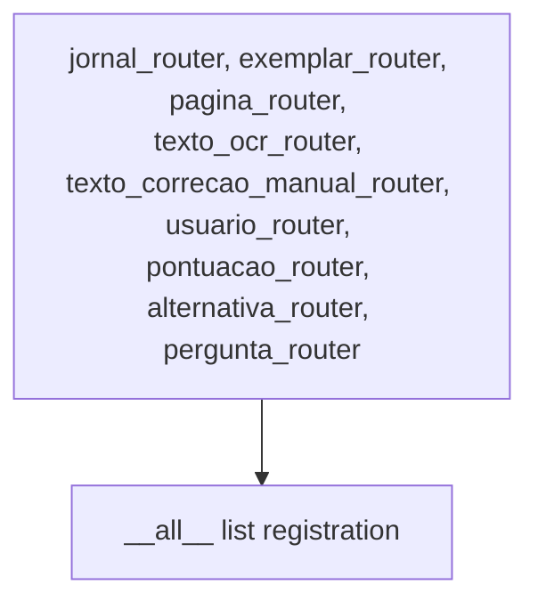
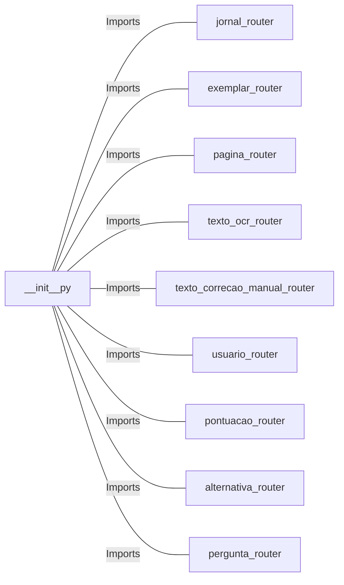

# __init__.py: Router Configuration

## Overview

This document describes the router configuration for a Python application, detailing the import and registration of various routers associated with different controllers within the application.

## Process Flow

## Insights

- The file serves as a central point for importing and registering routers from different controllers, facilitating their management and accessibility.
- Each router is associated with a specific controller, indicating a modular approach to handling different aspects of the application such as journal entries, exemplars, pages, OCR texts, manual text corrections, users, scores, alternatives, and questions.
- The `__all__` list explicitly declares the routers that are available for import when the package is imported elsewhere, enhancing code readability and maintainability.

## Dependencies

- `jornal_router` : Router for handling journal-related requests.
- `exemplar_router` : Router for handling exemplar-related requests.
- `pagina_router` : Router for handling page-related requests.
- `texto_ocr_router` : Router for handling OCR text-related requests.
- `texto_correcao_manual_router` : Router for handling manual text correction requests.
- `usuario_router` : Router for handling user-related requests.
- `pontuacao_router` : Router for handling scoring-related requests.
- `alternativa_router` : Router for handling alternative-related requests.
- `pergunta_router` : Router for handling question-related requests.