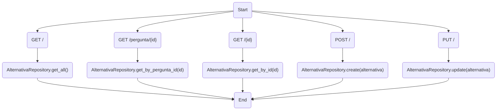
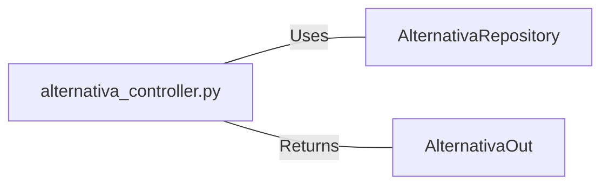

# alternativa_controller.py: Alternativa Controller

## Overview

This module defines an API controller for managing "Alternativa" entities. It provides endpoints for retrieving all alternatives, retrieving alternatives by question ID or by their own ID, and for creating or updating alternatives. The controller uses FastAPI for routing and relies on an `AlternativaRepository` for data access.

## Process Flow

## Insights

- The controller provides CRUD operations for "Alternativa" entities.
- It uses `AlternativaRepository` for data access, abstracting the database interactions.
- The endpoints return `AlternativaOut` schema objects, ensuring a consistent data format for the API responses.
- Logging is configured, allowing for tracking of operations and errors within the controller.
- The use of `Optional` in response models indicates that some endpoints may return `None`, handling cases where the requested data does not exist.

## Dependencies

- `AlternativaRepository` : The controller uses this for all database interactions, including fetching, creating, and updating "Alternativa" entities.
- `AlternativaOut` : This schema defines the structure of the response objects returned by the controller's endpoints.