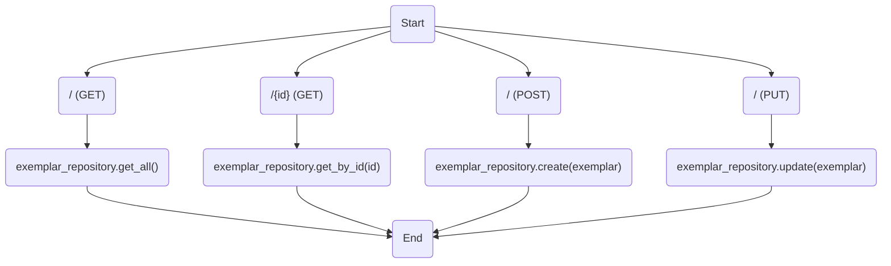
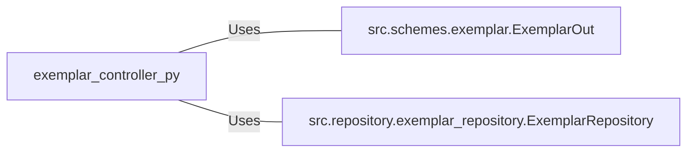

# exemplar_controller.py: Exemplar Management API Endpoints

## Overview
This document describes the API endpoints for managing Exemplar entities, including retrieving, creating, and updating exemplars. It utilizes FastAPI for routing and relies on a repository pattern for data access.

## Process Flow

## Insights
- The API provides four main operations: listing all exemplars, retrieving a specific exemplar by ID, creating a new exemplar, and updating an existing exemplar.
- It uses HTTP status codes to indicate the result of operations, specifically `200 OK` for successful retrievals and updates, and `201 Created` for successful creation of an exemplar.
- The API operations are asynchronous, enhancing performance and scalability.
- Data validation and serialization are handled using Pydantic models, specifically `ExemplarOut`.
- The repository pattern is used for data access, abstracting the database operations from the API logic.

## Dependencies

- `ExemplarOut` : Pydantic model used for data validation and serialization.
- `ExemplarRepository` : Repository class for accessing exemplar data.