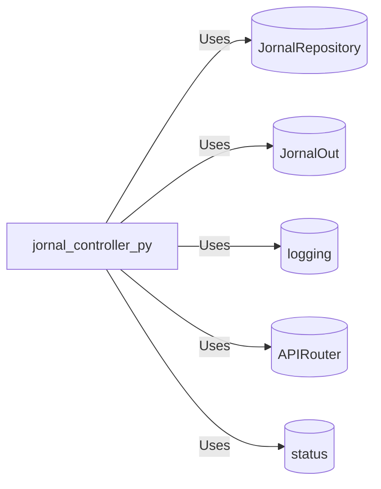

# jornal_controller.py: Jornal Management API Endpoints

## Overview
This module defines API endpoints for managing jornals, including operations to create, read, update, and list jornals. It utilizes FastAPI for routing and relies on a repository pattern for data access.

## Process Flow
```mermaid
graph TD
    Start(Start) --> GetJornals[/get_jornals/]
    Start --> GetJornalById[/get_jornal/{id}/]
    Start --> CreateJornal[/create_jornal/]
    Start --> UpdateJornal[/update_jornal/]
    GetJornals --> LogGetAll("Log: Getting all jornals")
    GetJornalById --> LogGetById("Log: Getting jornal with id")
    CreateJornal --> LogCreate("Log: Creating jornal")
    UpdateJornal --> LogUpdate("Log: Updating jornal")
    LogGetAll --> RepoGetAll{JornalRepository.get_all()}
    LogGetById --> RepoGetById{JornalRepository.get_by_id(id)}
    LogCreate --> RepoCreate{JornalRepository.create(jornal)}
    LogUpdate --> RepoUpdate{JornalRepository.update(jornal)}
    RepoGetAll --> End(End)
    RepoGetById --> End
    RepoCreate --> End
    RepoUpdate --> End
```

## Insights
- The module defines four main operations for jornal management: listing all jornals, retrieving a specific jornal by ID, creating a new jornal, and updating an existing jornal.
- It uses the FastAPI framework for defining and handling API routes.
- Logging is implemented for each operation to track the process flow.
- The `JornalRepository` class from the `jornal_repository` module is used for data access, adhering to the repository pattern.
- The `JornalOut` schema from the `src.schemes.jornal` module is used as the response model for the endpoints.
- HTTP status codes are explicitly defined for each endpoint, indicating the nature of the response (e.g., 200 OK, 201 Created).

## Dependencies

- `JornalRepository` : The repository class for accessing jornal data. It is used for CRUD operations on jornals.
- `JornalOut` : The Pydantic model representing the output schema for jornal data.
- `logging` : Used for logging operations within the controller.
- `APIRouter` : FastAPI's router, used for defining the API routes.
- `status` : FastAPI's status module, used for defining HTTP status codes.