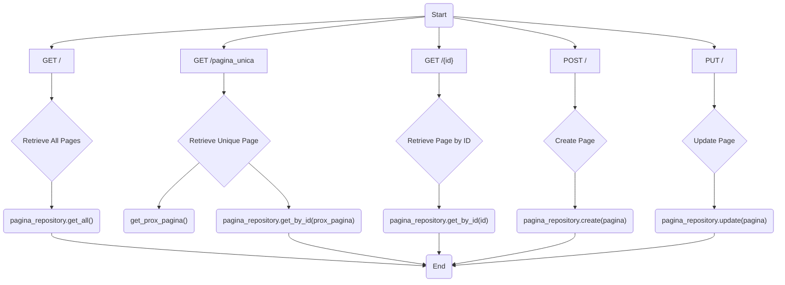
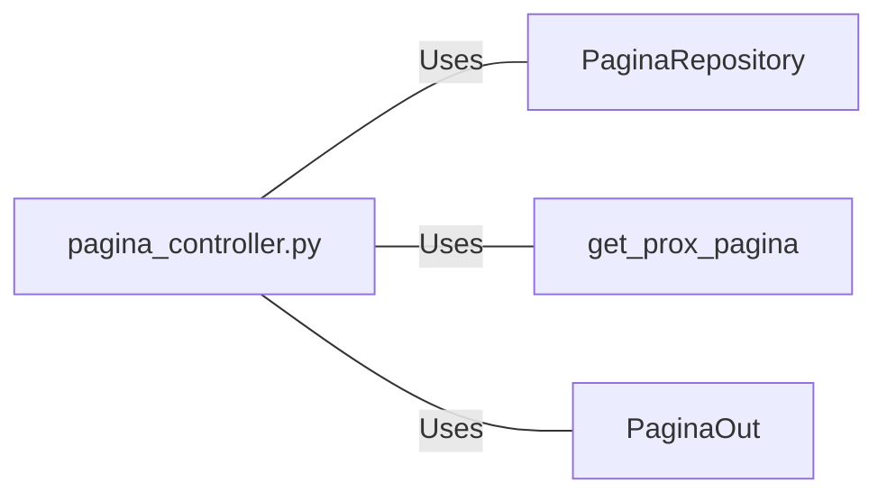

# pagina_controller.py: Pagina Management API Endpoints

## Overview
This document describes the API endpoints for managing "Pagina" entities, including retrieval, creation, and update operations. It utilizes FastAPI for routing and integrates with a repository layer for database operations.

## Process Flow

## Insights
- The API provides endpoints for listing all pages, fetching a unique page, fetching a page by ID, creating a new page, and updating an existing page.
- Utilizes FastAPI for routing and HTTP status code management.
- Integrates with a repository layer (`PaginaRepository`) for database operations, abstracting the data access logic.
- Employs a utility function `get_prox_pagina` to determine the next unique page to be fetched.
- Uses `PaginaOut` schema for input validation and response model formatting.
- Implements logging for tracking and debugging purposes.

## Dependencies

- `PaginaRepository` : Handles database operations related to "Pagina" entities, including retrieval, creation, and update.
- `get_prox_pagina` : Utility function to determine the next unique page to be fetched.
- `PaginaOut` : Schema for input validation and response model formatting.