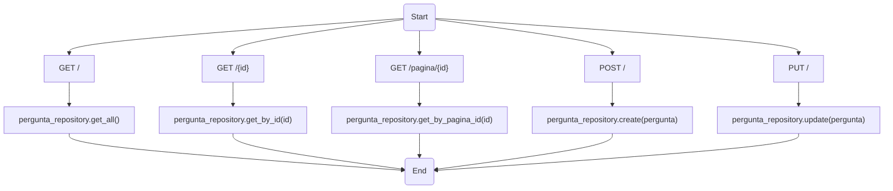
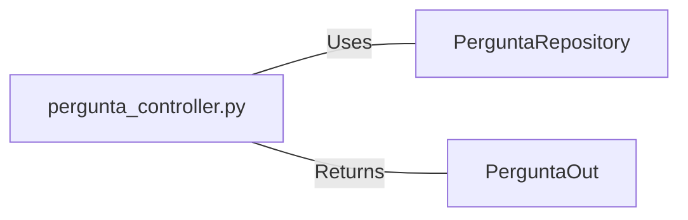

# pergunta_controller.py: Pergunta Controller

## Overview

This module defines a FastAPI router for handling operations related to `Pergunta` entities, including retrieving, creating, and updating questions. It interacts with a repository layer to perform database operations.

## Process Flow

## Insights

- The controller provides endpoints for CRUD operations on `Pergunta` entities.
- It uses dependency injection to interact with the `PerguntaRepository` for database operations.
- The controller handles HTTP status codes, ensuring proper API responses.
- Logging is configured, allowing for monitoring and debugging.
- Type hints are used throughout for clarity and type checking.

## Dependencies

- `PerguntaRepository` : The controller uses this for database operations, including fetching, creating, and updating `Pergunta` entities.
- `PerguntaOut` : This schema is used for typing the response models of the API endpoints.