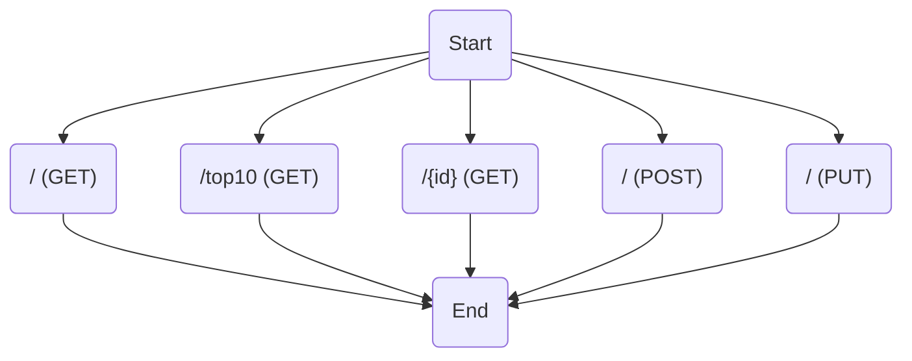
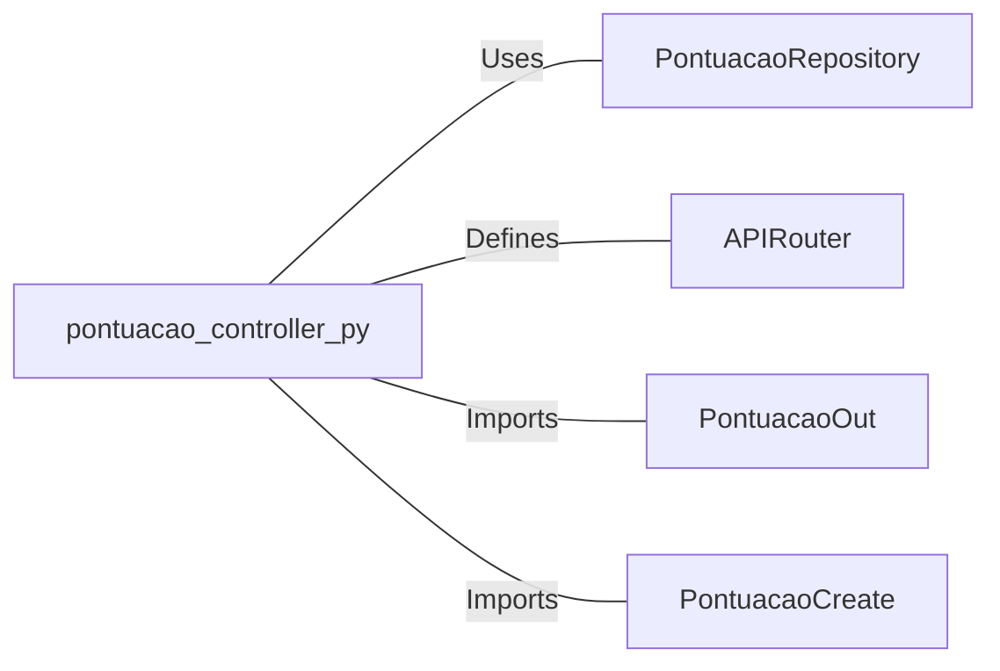

# pontuacao_controller.py: Pontuação Controller

## Overview

This document describes the `pontuacao_controller.py`, which is responsible for handling HTTP requests related to the management of pontuação (score) entities. It provides functionalities to retrieve, create, and update pontuação records through a RESTful API interface.

## Process Flow

## Insights

- The controller defines five endpoints for operations related to pontuação entities.
- It uses the `PontuacaoRepository` for data access, indicating a separation of concerns between the controller and the data layer.
- The endpoints are asynchronous, which is suitable for IO-bound operations like database access.
- Error handling is implemented in the `create_pontuacao` endpoint, which catches exceptions and logs them.
- The use of `Optional` in response models suggests that some operations might not return a result (e.g., searching for a non-existent ID).

## Dependencies

- `PontuacaoRepository` : The controller uses this for all database operations, including retrieval and manipulation of pontuação records.
- `APIRouter` : FastAPI's APIRouter is used to define the HTTP endpoints.
- `PontuacaoOut` : This schema is used for output serialization of pontuação entities.
- `PontuacaoCreate` : This schema is used for input validation and serialization when creating new pontuação records.