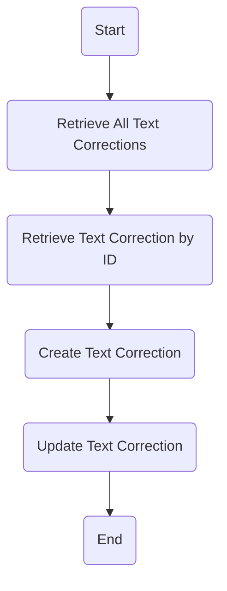
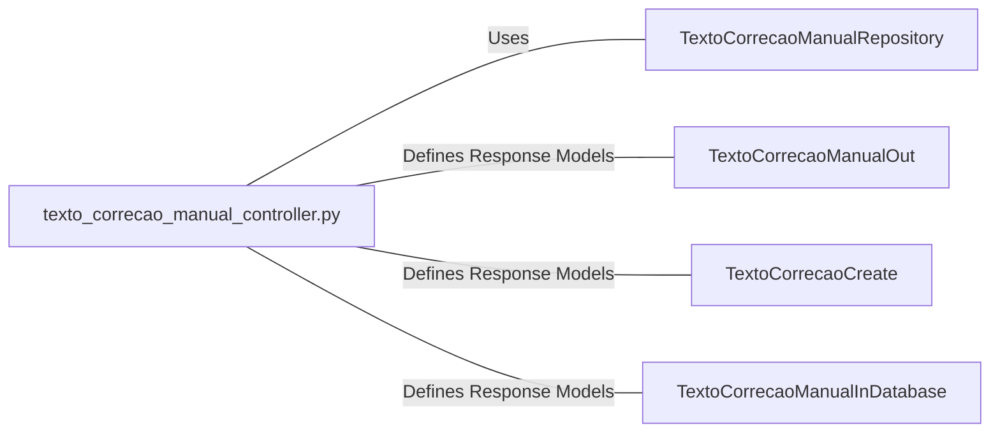

# texto_correcao_manual_controller.py: Text Correction Manual Controller

## Overview
This controller manages operations related to manual text corrections, including retrieving, creating, and updating text correction records.

## Process Flow

## Insights
- The controller provides endpoints for CRUD operations on text corrections.
- It uses FastAPI for routing and status code management.
- The data models for input and output are defined in separate schema files.
- Exception handling is implemented in the creation endpoint, logging the exception without further action.
- The repository pattern is used for database operations, abstracting the data access logic.

## Dependencies

- `TextoCorrecaoManualRepository` : Handles database operations for text corrections.
- `TextoCorrecaoManualOut` : Schema for output data of text corrections.
- `TextoCorrecaoCreate` : Schema for creating new text corrections.
- `TextoCorrecaoManualInDatabase` : Schema representing the database model of text corrections.