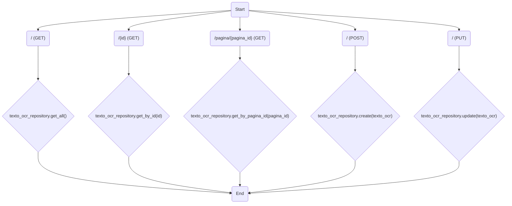
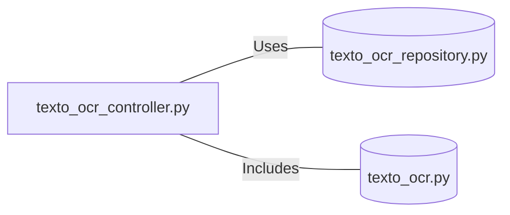

# texto_ocr_controller.py: Text OCR Controller

## Overview

This module defines a FastAPI controller for operations related to Text OCR (Optical Character Recognition). It provides endpoints for retrieving, creating, and updating OCR text data.

## Process Flow

## Insights

- The controller provides five main endpoints:
  - A `GET` endpoint at the root path to retrieve all OCR text data.
  - Two `GET` endpoints to retrieve OCR text data by its unique ID or by a page ID.
  - A `POST` endpoint at the root path to create new OCR text data.
  - A `PUT` endpoint at the root path to update existing OCR text data.
- Each endpoint specifies a response model based on `TextoOcrOut` and a corresponding HTTP status code.
- The controller interacts with a repository, `TextoOcrRepository`, to perform CRUD operations on the OCR text data.
- The use of `Optional` in the response model indicates that the endpoints may return `None` if the requested data is not found.

## Dependencies

- `texto_ocr_repository.py` : The controller uses functions from `TextoOcrRepository` to interact with the database, including retrieving, creating, and updating OCR text data.
- `texto_ocr.py` : Defines the `TextoOcrOut` schema used as the response model for the controller's endpoints.