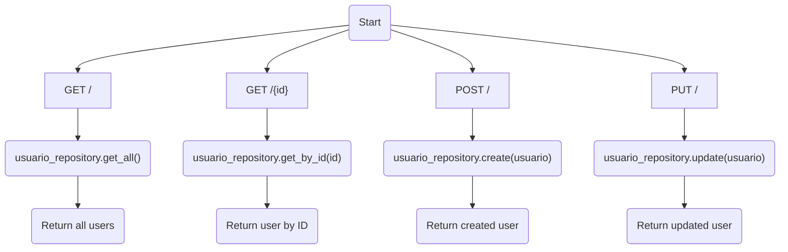
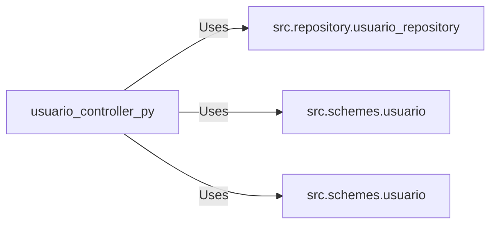

# usuario_controller.py: User Management Endpoints

## Overview

This module defines HTTP endpoints for managing user data, including retrieving all users, retrieving a single user by ID, creating a new user, and updating an existing user. It utilizes FastAPI for routing and integrates with a user repository for data access.

## Process Flow

## Insights

- The module uses FastAPI's `APIRouter` for routing HTTP requests.
- It defines four endpoints for user management: retrieving all users, retrieving a user by ID, creating a user, and updating a user.
- The endpoints utilize the `UsuarioRepository` for data access operations.
- The `UsuarioOut` and `UsuarioCreate` schemas from `src.schemes.usuario` are used for input validation and response modeling.
- HTTP status codes are explicitly set for each endpoint, with successful operations returning `200 OK` for retrieval and `201 CREATED` for user creation.
- Exception handling is implemented in the user creation endpoint to catch and log errors during the user creation process.

## Dependencies

- `UsuarioRepository` : The user repository class used for data access operations. It interacts with the database to retrieve, create, and update user data.
- `UsuarioOut` : The schema used for validating and serializing user data for output.
- `UsuarioCreate` : The schema used for validating user data for creation.