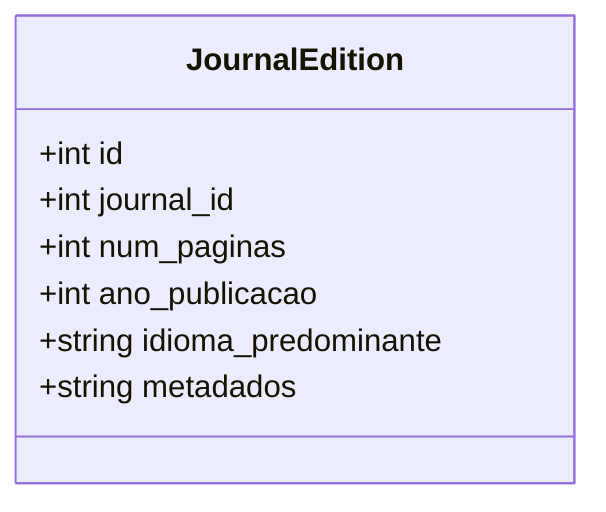

# exemplar.csv: Data Structure for Journal Editions

## Overview
This document describes a data structure designed to store information about journal editions. It includes details such as the journal's ID, number of pages, year of publication, predominant language, and metadata regarding the edition's dimensions.

## Process Flow

## Insights
- The data structure is represented as a CSV file, indicating it is intended for data storage and possibly for data exchange purposes.
- Each record in the CSV file corresponds to a specific edition of a journal, with fields capturing essential bibliographic and physical characteristics.
- The `metadados` field likely contains information about the physical dimensions of the journal edition, suggesting that the data structure could be used in contexts where physical storage or printing considerations are relevant.
- The inclusion of `idioma_predominante` (predominant language) implies that the journals may cater to a multilingual audience or have editions in different languages.
- The structure is simple and straightforward, making it easy to parse and manipulate using standard CSV processing tools or libraries in various programming languages.