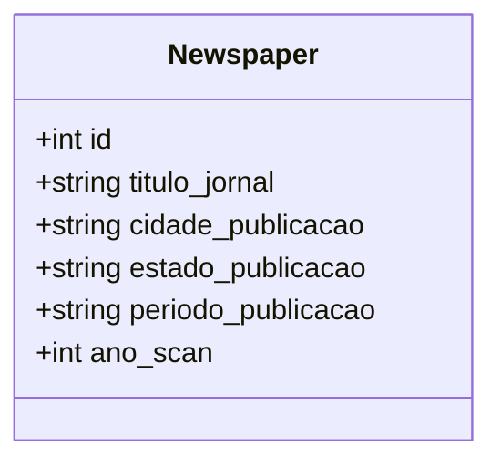

# jornal.csv: Historical Newspaper Records

## Overview
This document describes a data structure that contains historical records of newspapers. It includes information such as the newspaper's title, city and state of publication, publication period, and the year the records were scanned.

## Process Flow

## Insights
- The data structure is a CSV file, indicating a simple, tabular format for storing the records.
- Each record includes a unique identifier (`id`), suggesting that the data can be easily indexed or searched.
- The `periodo_publicacao` field indicates the range of years the newspaper was published, which could be useful for historical research or analysis.
- All records have the same `ano_scan` value (2018), implying that the scanning project for these newspapers was conducted in the same year.
- The newspapers are from various cities and states, indicating a diverse geographical coverage within Brazil.

## Dependencies
This section is not applicable as the data structure does not have external dependencies.