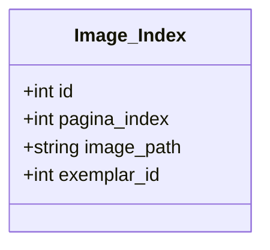

# pagina.csv: Image Index Data Structure

## Overview
This document describes a data structure that indexes images related to a project. It is structured as a CSV file containing information about image paths and their associated metadata.

## Process Flow

## Insights
- The data structure is designed to keep track of images used in a project, specifically for training purposes.
- Each entry includes a unique identifier (`id`), a page index (`pagina_index`), the path to the image file (`image_path`), and an identifier for the exemplar (`exemplar_id`).
- All images are part of the same exemplar, as indicated by the `exemplar_id` being 0 for all entries.
- The `pagina_index` suggests that images are ordered or can be referenced by their page number within a larger collection or document.
- The `image_path` indicates that images are stored within a specific directory structure on a filesystem, likely for a project named `GBN` or related to a publication named `DerGemeindebote`.
- The data structure does not explicitly include metadata about the content of the images, their format, or resolution.