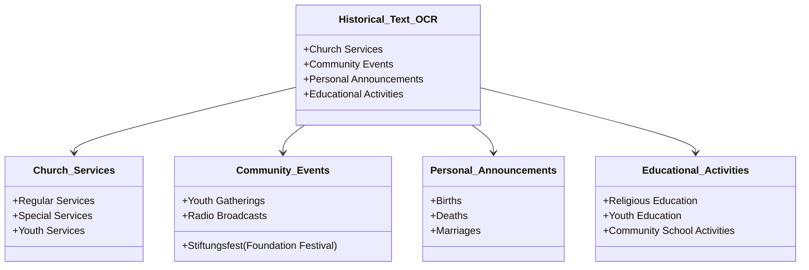
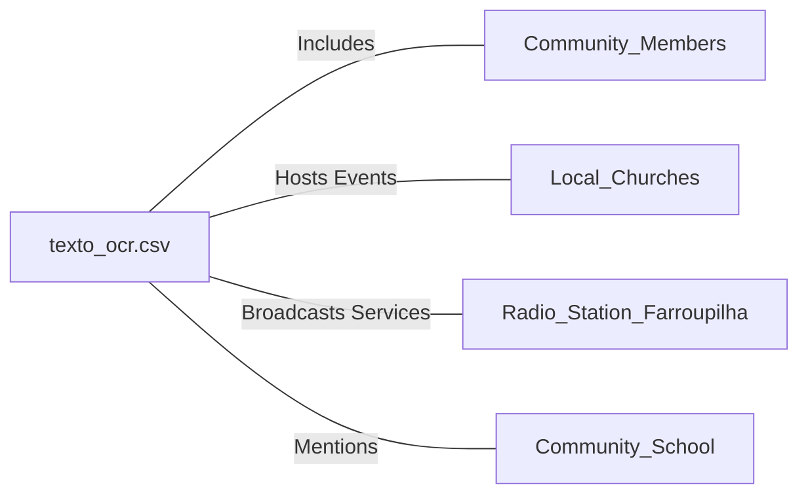

# texto_ocr.csv: Documentation of Historical Text OCR

## Overview
This document provides an analysis and interpretation of a historical text obtained through Optical Character Recognition (OCR). The text appears to be a collection of articles, announcements, and reports related to a Lutheran community, possibly in Brazil, given the references to Portuguese language and Brazilian locations. It covers various aspects of community life, including church services, community events, and personal announcements.

## Process Flow

## Insights

- The text is a compilation of various articles and announcements related to a Lutheran community, indicating a well-organized and active religious and social life.
- References to specific locations such as "Novo Hamburgo" and "Campo Bom" suggest the community is located in Brazil.
- The text mentions the use of Portuguese language alongside German, indicating a bilingual community possibly composed of German immigrants or descendants in Brazil.
- The community appears to be engaged in educational activities, including religious education and possibly running a community school.
- The mention of radio broadcasts suggests the community's efforts to reach a wider audience or members who are unable to attend services in person.
- The document includes personal announcements such as births, deaths, and marriages, highlighting the close-knit nature of the community.
- The reference to a "Stiftungsfest" (foundation festival) suggests the community celebrates its heritage and foundation, possibly marking the anniversary of the church or community establishment.

## Dependencies

- **Community Members**: The primary contributors and participants in the events and services mentioned.
- **Local Churches**: Locations where services and community events are held.
- **Radio Station Farroupilha**: A medium through which the community broadcasts religious services.
- **Community School**: An educational institution mentioned in the context of educational activities and youth education.

## Data Manipulation (SQL)

- No explicit SQL data manipulation or database structures are mentioned in the text.