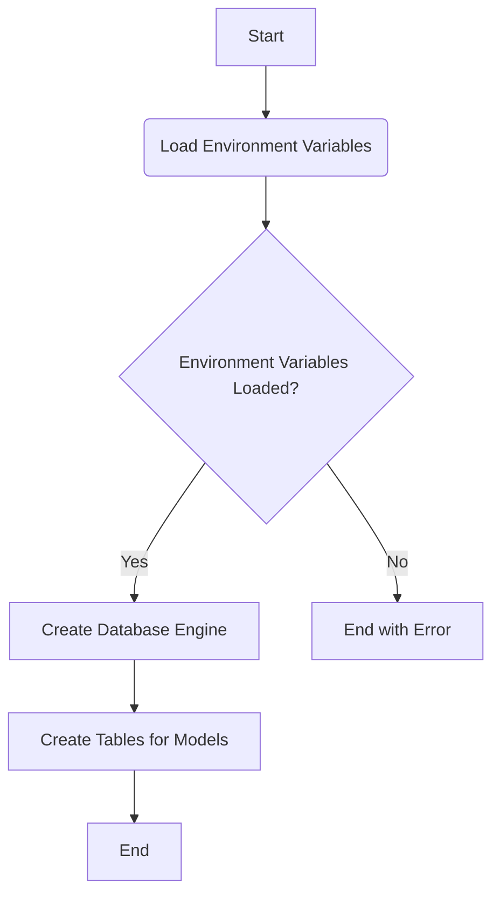
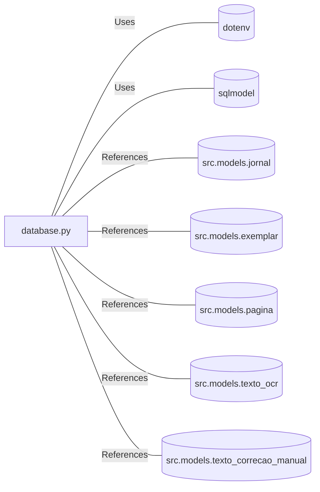

# database.py: Database Initialization and Table Creation

## Overview
This module is responsible for initializing the database connection using environment variables and creating the necessary tables for the application. It leverages the `sqlmodel` library for ORM operations and structures.

## Process Flow

## Insights
- Utilizes `dotenv` to load environment variables, ensuring sensitive information is not hard-coded.
- The database connection string is retrieved from environment variables, enhancing security and flexibility.
- Employs `SQLModel` for ORM, facilitating interactions with the database through Python objects.
- Defines a function `get_engine` to provide access to the database engine across the application.
- The `create_db_and_tables` function initializes the database schema based on defined models, supporting easy setup and maintenance.
- Models for `Jornal`, `Exemplar`, `Pagina`, `TextoOcr`, and `TextoCorrecaoManual` are explicitly initialized, indicating these are the primary entities within the application.

## Dependencies

- `dotenv` : Used for loading environment variables, nature of the relation is to access configuration securely.
- `sqlmodel` : ORM library used for database interactions, nature of the relation is to facilitate database operations.
- `src.models.jornal` : Model representing the `Jornal` entity, nature of the relation is to define database schema.
- `src.models.exemplar` : Model representing the `Exemplar` entity, nature of the relation is to define database schema.
- `src.models.pagina` : Model representing the `Pagina` entity, nature of the relation is to define database schema.
- `src.models.texto_ocr` : Model representing the `TextoOcr` entity, nature of the relation is to define database schema.
- `src.models.texto_correcao_manual` : Model representing the `TextoCorrecaoManual` entity, nature of the relation is to define database schema.