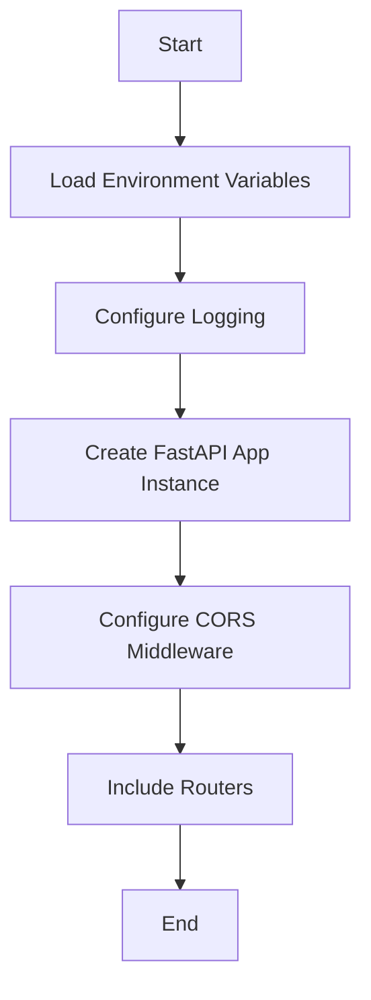
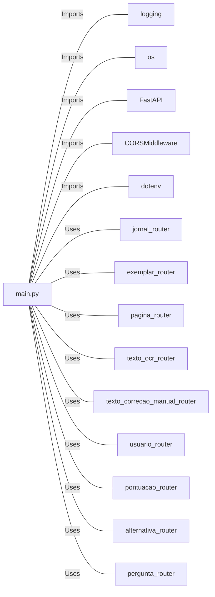

# main.py: FastAPI Application Setup

## Overview
This document describes the setup and configuration of a FastAPI application, focusing on its structure, middleware integration, and routing.

## Process Flow

## Insights
- The application is configured to log information with a specific format including timestamp, log level, and message.
- CORS (Cross-Origin Resource Sharing) middleware is added to allow requests from any origin, which is crucial for API accessibility from different domains.
- The application routes are organized into separate routers, each prefixed with a specific path and tagged for better organization and documentation.
- Environment variables are loaded at the beginning, which is a best practice for configuring applications without hard-coding sensitive information.

## Dependencies

- `logging` : Used for configuring the logging level and format.
- `os` : Might be used for accessing environment variables or file paths.
- `FastAPI` : The core framework used to create the web application.
- `CORSMiddleware` : Middleware for handling Cross-Origin Resource Sharing (CORS) settings.
- `dotenv` : Used for loading environment variables from a `.env` file.
- `jornal_router`, `exemplar_router`, `pagina_router`, `texto_ocr_router`, `texto_correcao_manual_router`, `usuario_router`, `pontuacao_router`, `alternativa_router`, `pergunta_router` : Routers for different parts of the application, each handling a specific set of routes related to their respective domains.