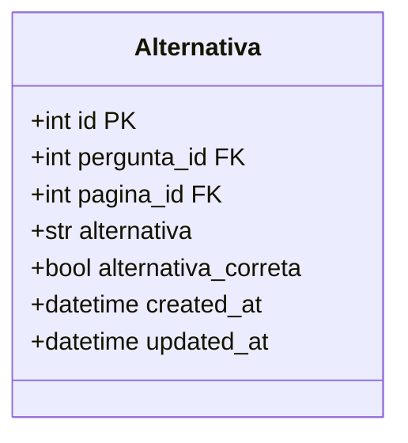
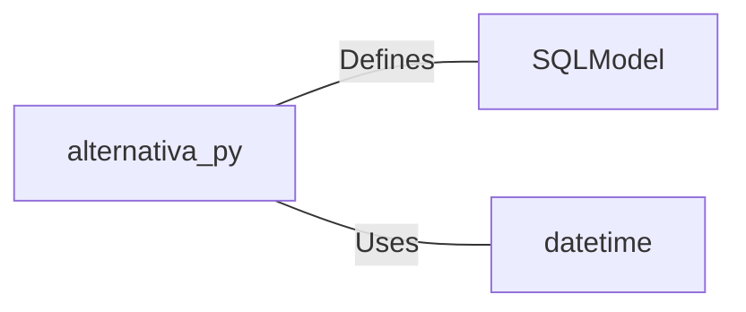

# alternativa.py: Alternativa Model Definition

## Overview
This document describes the structure and key elements of the `Alternativa` model, which is designed to represent an alternative or option within a larger system, likely a quiz or survey application. The model is defined using SQLModel, which integrates SQLAlchemy with Pydantic for creating SQL table definitions with Python type annotations.

## Process Flow

## Insights
- The `Alternativa` model is a SQL table representation, indicating it's part of a database schema.
- It includes a primary key (`id`), which is optional and can be auto-generated by the database.
- The model has foreign keys to `pergunta.id` and `pagina.id`, suggesting relationships with other tables/entities named `pergunta` and `pagina`.
- Fields `alternativa` and `alternativa_correta` store the text of the alternative and a boolean indicating if it's the correct answer, respectively.
- Timestamps for creation and update (`created_at`, `updated_at`) are automatically managed by the model, using the current UTC time.

## Dependencies

- `SQLModel` : The Alternativa model is defined using SQLModel, indicating a dependency on this library for ORM capabilities.
- `datetime` : Utilized for managing `created_at` and `updated_at` fields, indicating usage of Python's datetime module for time-related functionalities.