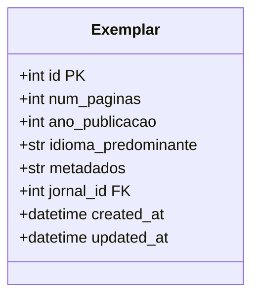
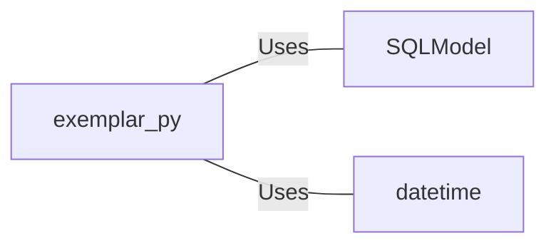

# exemplar.py: Exemplar Data Model

## Overview
This code defines a data model for an entity named `Exemplar`, which represents a record in a database table. The model includes various fields such as the number of pages, publication year, predominant language, metadata, and associated journal ID. It also tracks the creation and update timestamps.

## Process Flow

## Insights
- The `Exemplar` model is designed to be stored in a database table, as indicated by the `table=True` parameter in the class definition.
- It uses `SQLModel` for ORM (Object-Relational Mapping), which simplifies interactions with the database.
- The `id` field is optional and serves as the primary key. It does not have a default value, implying it's expected to be auto-generated by the database.
- The `jornal_id` field is a foreign key linking to a `jornal` table, indicating a relationship between `Exemplar` and `Jornal`.
- The `created_at` and `updated_at` fields use the current UTC time as their default values, automatically tracking when each record is created and last updated.
- The model includes type annotations for all fields, enhancing code readability and type safety.

## Dependencies

- `SQLModel` : ORM framework used for defining the `Exemplar` model, facilitating database interactions.
- `datetime` : Module used for handling date and time, specifically for `created_at` and `updated_at` fields.