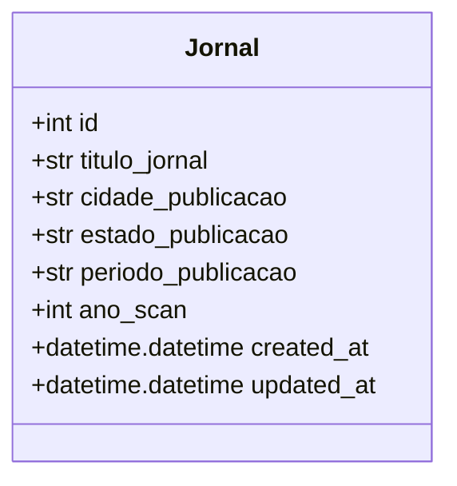
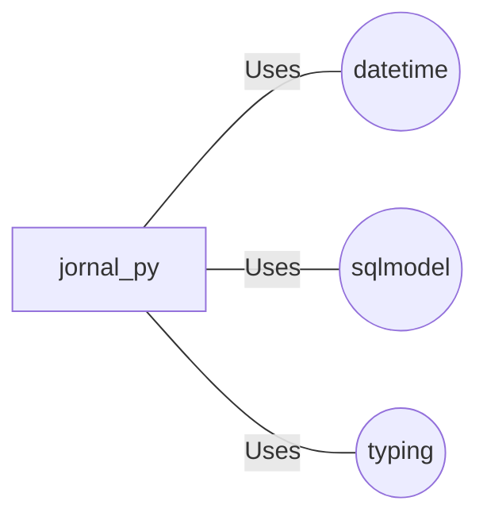

# jornal.py: Journal Database Model

## Overview
This code defines a data structure for a journal database model using SQLModel, which is a library that combines the capabilities of SQL databases with Python's type annotations. The `Jornal` class represents a journal entry in the database with various fields including identifiers, publication details, and timestamps for creation and updates.

## Process Flow

## Insights
- The `Jornal` class is designed to be a table within a SQL database, as indicated by the `table=True` parameter in its declaration.
- It uses optional typing for the `id` field, allowing it to be `None` by default, which is useful for auto-generated primary keys.
- The `titulo_jornal` field is indexed, which can improve search performance on this column.
- The `created_at` and `updated_at` fields use the `datetime.datetime.utcnow` function to automatically set their values to the current UTC time when a new record is created or updated.
- The model includes both mandatory fields (like `titulo_jornal`, `cidade_publicacao`, `estado_publicacao`, `periodo_publicacao`, and `ano_scan`) and optional fields (`id`), providing flexibility in data entry.
- This model does not include relationships to other tables, focusing solely on the attributes of a journal.

## Dependencies
This model depends on external libraries for its functionality:

- `datetime` : Provides date and time functionality, used for `created_at` and `updated_at` fields.
- `sqlmodel` : Combines SQL databases with Python's type annotations, used for defining the `Jornal` model.
- `typing` : Supports type hints in the code, used for optional typing and list typing.