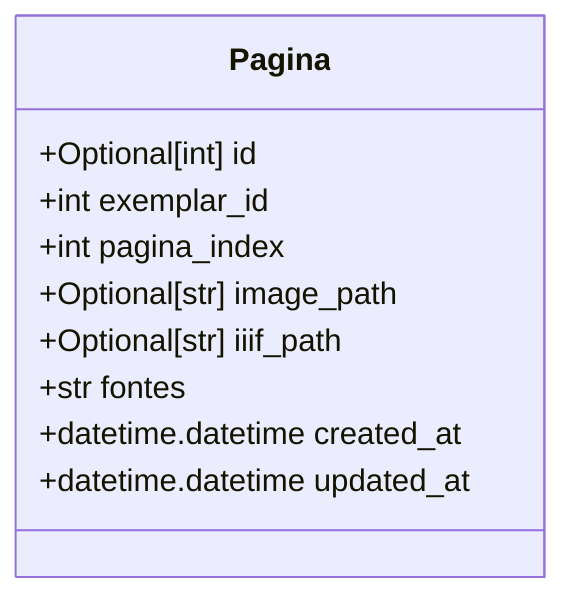

# pagina.py: Pagina Model Definition

## Overview
This document describes the structure and fields of the `Pagina` model, which is designed to represent a page within a larger document or exemplar. The model includes fields for identifying the page, linking it to its parent exemplar, storing paths to image resources, and tracking creation and update timestamps.

## Process Flow

## Insights
- The `Pagina` model is designed as a SQL table, indicating its use within a database.
- It uses the `SQLModel` framework for integration with SQL databases, leveraging both ORM and data typing features from Python.
- The `id` field serves as the primary key and is optional, allowing for automatic generation by the database.
- The `exemplar_id` field is a foreign key linking a `Pagina` instance to its parent `exemplar`, indicating a one-to-many relationship between exemplars and pages.
- The model includes fields for both a local image path (`image_path`) and an IIIF (International Image Interoperability Framework) path (`iiif_path`), suggesting support for both local and web-based image resources.
- The `fontes` field defaults to "Fraktur", indicating a default font style or source for the page content.
- Timestamps for creation and last update are automatically managed by the model, using the current UTC time as default values.

## Dependencies

- `exemplar.id` : The `exemplar_id` field in `Pagina` references the `id` field of an `exemplar` entity, establishing a foreign key relationship. This indicates that each `Pagina` is associated with a specific `exemplar`.