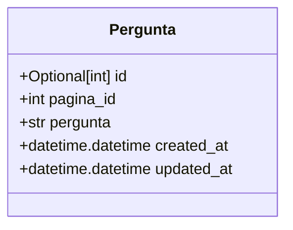
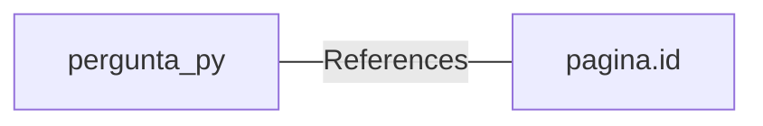

# pergunta.py: Pergunta Model Definition

## Overview
This document describes the structure and key elements of the `Pergunta` model, which is designed to represent questions within a database. It includes details on the model's fields, their data types, and relationships.

## Process Flow

## Insights
- The `Pergunta` model is a SQL table representation.
- It includes an optional primary key `id`, which if not provided, defaults to `None`.
- The `pagina_id` field is a foreign key that links to a `pagina` table's `id` field.
- The `pergunta` field is a string that stores the question text.
- Both `created_at` and `updated_at` fields are automatically set to the current UTC time when a new record is created, using `datetime.datetime.utcnow`.

## Dependencies

- `pagina.id` : The `pagina_id` field in `Pergunta` model references the `id` field in the `pagina` table, establishing a foreign key relationship.