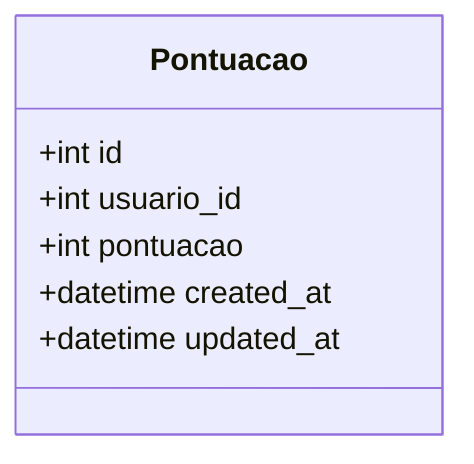
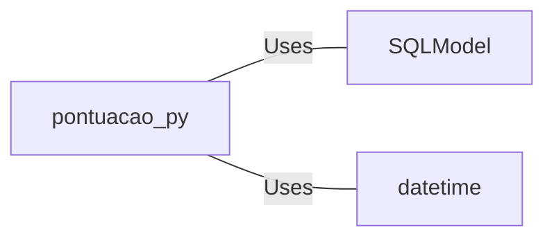

# pontuacao.py: Database Model for User Scores

## Overview
This code defines a SQLModel for storing user scores, including metadata such as creation and update timestamps.

## Process Flow

## Insights
- The `Pontuacao` class is designed as a database table model.
- It includes an optional `id` field, which serves as the primary key.
- The `usuario_id` field is a foreign key that links to a `usuario` table.
- The model tracks both the score (`pontuacao`) of a user and the timestamps for when the record was created (`created_at`) and last updated (`updated_at`).
- The `created_at` and `updated_at` fields are automatically populated with the current UTC time when a new record is created.

## Dependencies

- `SQLModel` : The class inherits from SQLModel, indicating dependency on the SQLModel package for ORM capabilities.
- `datetime` : Utilizes the datetime module for managing creation and update timestamps.