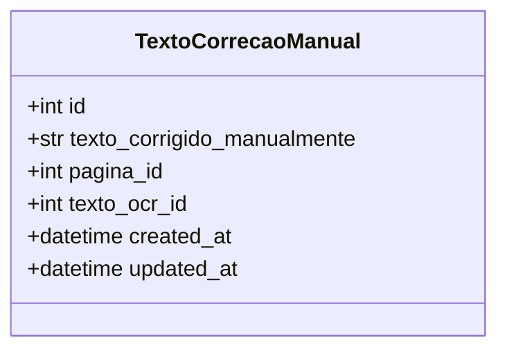
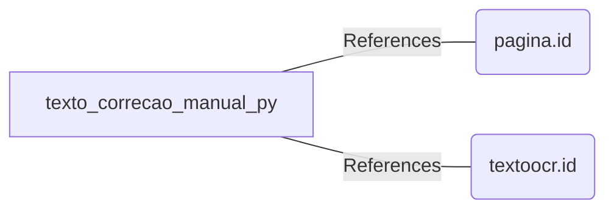

# texto_correcao_manual.py: Text Correction Manual Entry

## Overview
This module defines a data structure for storing manually corrected text entries, typically extracted from OCR (Optical Character Recognition) processes. It includes metadata such as creation and update timestamps.

## Process Flow

## Insights
- The `TextoCorrecaoManual` class is designed to be stored in a database as it inherits from `SQLModel` with `table=True`.
- It uses `datetime.datetime.utcnow` to automatically set `created_at` and `updated_at` fields upon creation.
- The `id` field is optional and can be auto-generated, as indicated by `id: int | None`.
- Foreign keys `pagina_id` and `texto_ocr_id` link this table to other entities, presumably `pagina` and `textoocr` tables, indicating relationships.
- The `texto_corrigido_manualmente` field stores the manually corrected text extracted from OCR.

## Dependencies

- `pagina.id` : The `pagina_id` field in `TextoCorrecaoManual` references the `id` field in the `pagina` table, establishing a relationship between the manually corrected text and the page it belongs to.
- `textoocr.id` : The `texto_ocr_id` field in `TextoCorrecaoManual` references the `id` field in the `textoocr` table, linking the manually corrected text to its corresponding OCR text entry.