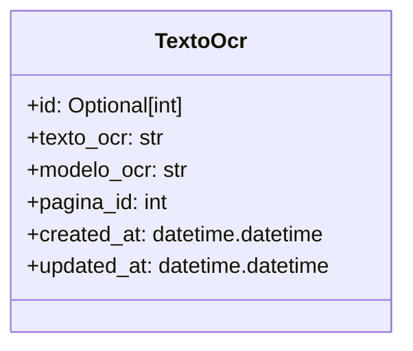
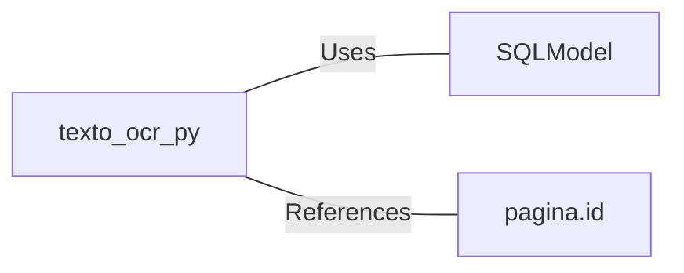

# texto_ocr.py: TextoOcr Data Structure

## Overview
This document describes the `TextoOcr` class, which is a data structure designed to store OCR (Optical Character Recognition) text results along with metadata. It is defined using SQLModel, making it suitable for database operations.

## Process Flow

## Insights
- The `TextoOcr` class is a SQLModel entity, indicating its use in a database context.
- It includes an optional primary key `id`, which suggests that it can be auto-generated by the database.
- The `texto_ocr` and `modelo_ocr` fields are required and store the OCR text and the OCR model used, respectively.
- The `pagina_id` field is a foreign key linking to a `pagina` table, indicating a relationship between OCR text and specific pages.
- `created_at` and `updated_at` fields are automatically set to the current UTC time upon creation and update, respectively, providing timestamps for tracking changes.

## Dependencies

- `SQLModel` : The class uses SQLModel for ORM (Object-Relational Mapping) capabilities, enabling interaction with the database.
- `pagina["pagina.id"]` : Indicates a foreign key relationship to a `pagina` table, specifically to the `id` column. This relationship is used to associate OCR text with specific pages.