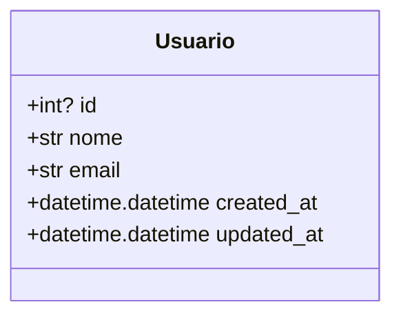
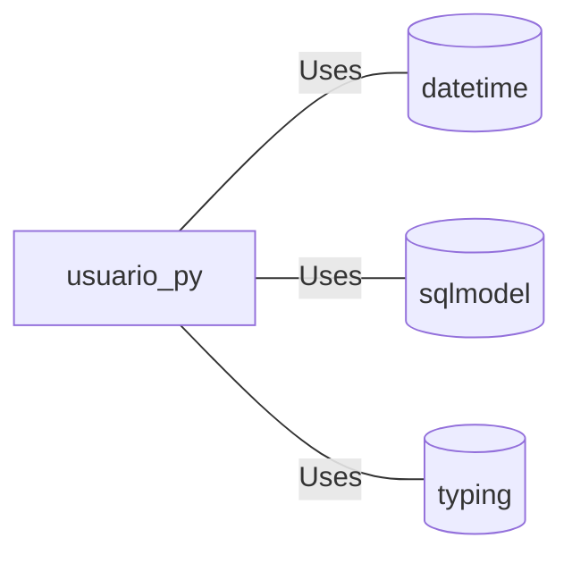

# usuario.py: User Management Data Structure

## Overview
This document describes the data structure used for managing user information within a system. It outlines the attributes associated with a user and the underlying database table structure.

## Process Flow

## Insights
- The `Usuario` class is designed to represent a user entity in a database, with automatic table creation enabled (`table=True`).
- It includes both mandatory (`nome`, `email`) and optional (`id`) fields. The `id` field serves as the primary key.
- The `nome` and `email` fields are indexed, optimizing search operations based on these attributes.
- Timestamps for record creation (`created_at`) and last update (`updated_at`) are automatically managed, using the current UTC time as default values.

## Dependencies
This data structure relies on external libraries for its definition and functionality:
- `datetime` from Python's standard library for timestamp fields.
- `Field`, `SQLModel` from `sqlmodel` for ORM (Object-Relational Mapping) capabilities and field definitions.
- `Optional`, `List` from `typing` for type hinting, although `List` is not utilized in the current structure.

