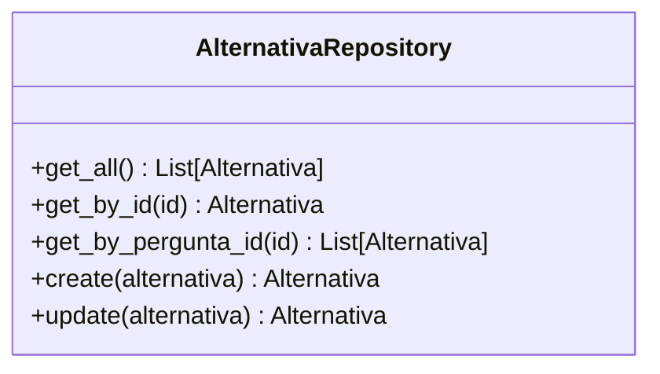
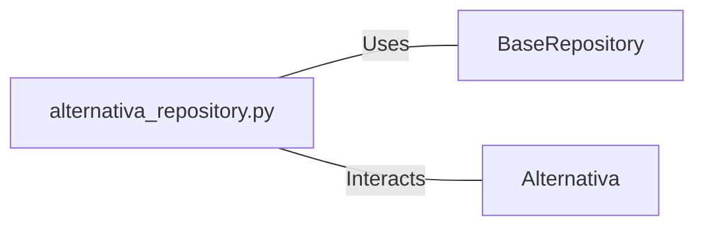

# alternativa_repository.py: Alternativa Repository Management

## Overview

This module defines the `AlternativaRepository` class, which provides methods to interact with the Alternativa data model. It extends functionalities from a base repository to perform CRUD operations specifically tailored for the `Alternativa` model.

## Process Flow

## Insights

- The `AlternativaRepository` class is designed to interact with the `Alternativa` data model, providing a layer of abstraction over the base repository's generic CRUD operations.
- It initializes with a specific model type (`Alternativa`) to ensure type safety and consistency across method calls.
- Methods `get_all`, `get_by_id`, and `get_by_pergunta_id` retrieve records from the database, with `get_by_pergunta_id` allowing for filtering by a specific column (`pergunta_id`).
- The `create` and `update` methods expect an instance of `Alternativa` as input. They internally use the `dict()` method of the input object to construct a new `Alternativa` instance, ensuring the data integrity before passing it to the base repository for persistence.

## Dependencies

- `BaseRepository` : The base class providing generic CRUD operations. `AlternativaRepository` uses these operations, specifying `Alternativa` as the model type.
- `Alternativa` : The data model representing an alternative. It is the primary entity managed by `AlternativaRepository`.