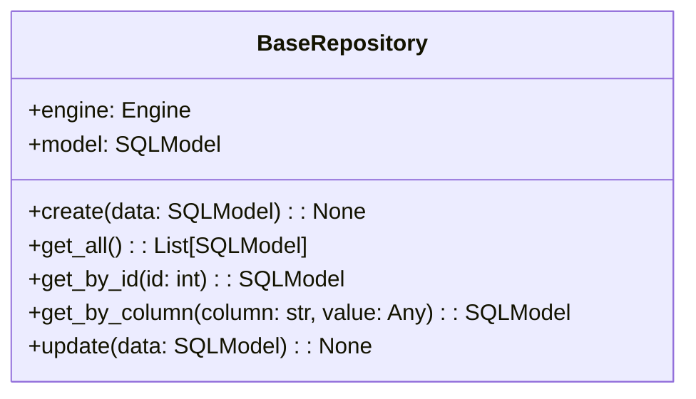
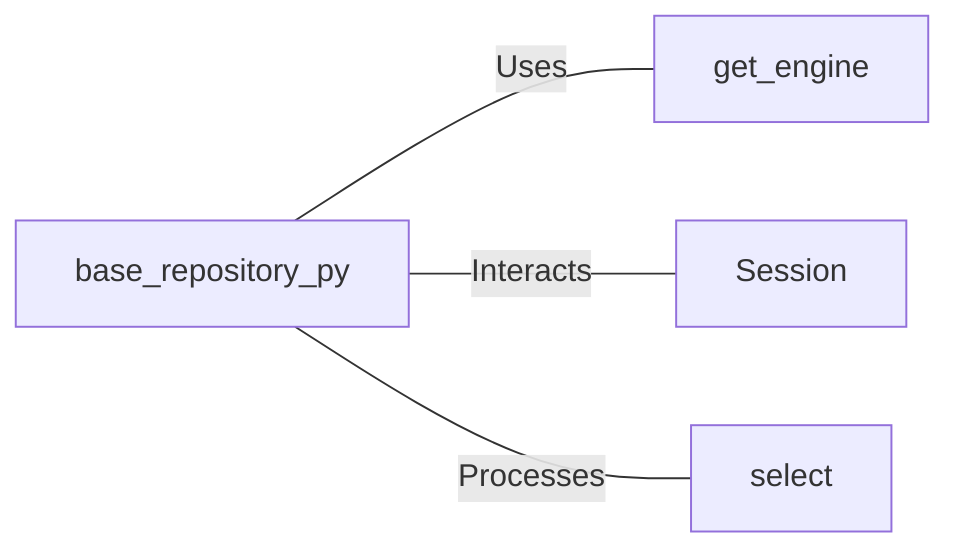

# base_repository.py: Base Repository Operations

## Overview
This module defines a `BaseRepository` class responsible for abstracting common database operations such as create, read (all, by ID, by column), and update. It utilizes SQLModel for ORM operations and interacts with the database through a session.

## Process Flow

## Insights
- The `BaseRepository` class requires a model class upon initialization, which it uses to perform database operations.
- It leverages the `get_engine` function from a separate module to establish a database connection.
- CRUD operations are encapsulated within the class methods, providing a clean interface for interacting with the database.
- The `update` method specifically requires a model instance with an `id` attribute and a `model_dump` method that supports the `exclude_unset` parameter.
- The class uses context managers to ensure that database sessions are properly managed and closed after operations.

## Dependencies

- `get_engine` : Provides the database engine for session creation. The nature of the relation is usage to establish database connections.
- `Session` : Used for managing database transactions. The class interacts with it for CRUD operations.
- `select` : SQLModel function for constructing SQL SELECT statements. It is used to query the database.