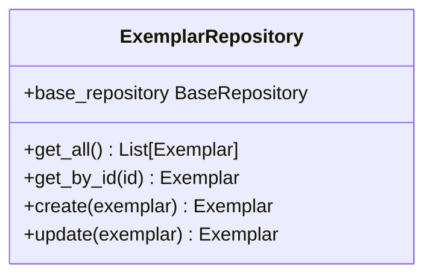
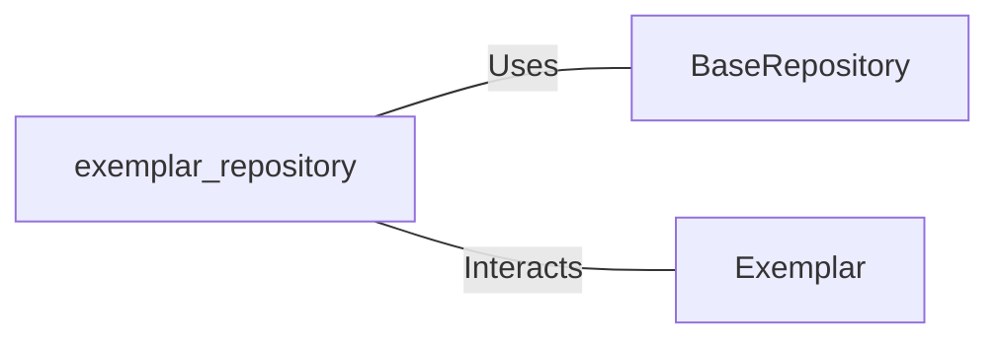

# exemplar_repository.py: Exemplar Repository Management

## Overview

This module defines the `ExemplarRepository` class, which provides methods for interacting with exemplar data. It extends the functionality of a base repository to specifically handle operations related to `Exemplar` objects, such as retrieving all exemplars, fetching an exemplar by ID, creating, and updating exemplar records.

## Process Flow

## Insights

- The `ExemplarRepository` class is designed to interact with exemplar data, leveraging the `BaseRepository` for common database operations.
- It initializes with a specific model type, `Exemplar`, to ensure that operations are performed on the correct dataset.
- Methods `get_all`, `get_by_id`, `create`, and `update` are provided to facilitate common data manipulation tasks, making it easier to manage exemplar records.
- The `create` and `update` methods expect an `exemplar` object, which is then converted to a dictionary and passed to the underlying base repository methods. This ensures that the data is correctly formatted for database operations.

## Dependencies

- `BaseRepository` : The `ExemplarRepository` uses `BaseRepository` for executing database operations such as create, read, update, and delete.
- `Exemplar` : This is the data model that `ExemplarRepository` manages. It defines the structure and types of the exemplar data.