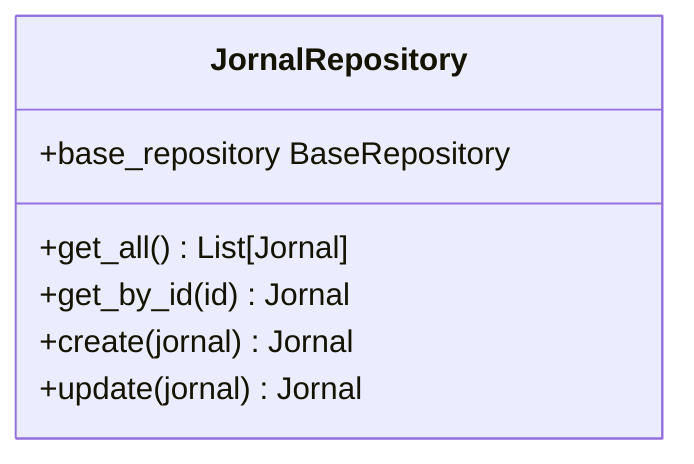
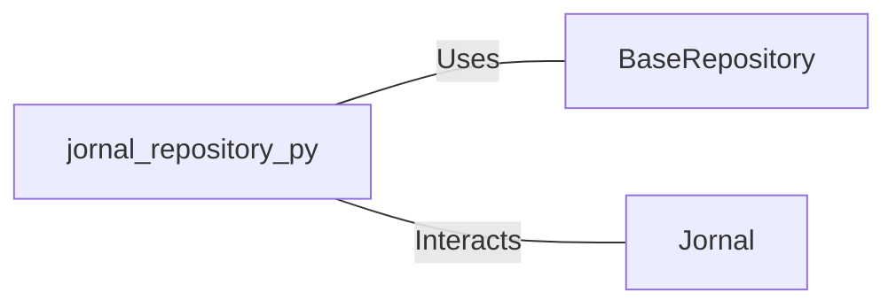

# jornal_repository.py: Jornal Repository Management

## Overview
This module defines the `JornalRepository` class responsible for managing CRUD operations for `Jornal` objects. It leverages a base repository for actual database interactions, abstracting the complexity of direct database manipulation.

## Process Flow

## Insights
- The `JornalRepository` class is designed to interact with `Jornal` model instances, providing a simplified interface for CRUD operations.
- It utilizes the `BaseRepository` for actual database operations, indicating a layer of abstraction that separates the business logic from data access logic.
- The `create` and `update` methods internally use the `Jornal` model's `dict()` method for object serialization, which suggests that `jornal` parameter is expected to be a Pydantic model or similar.
- Logging is configured to track the update operations, which aids in monitoring and debugging.

## Dependencies

- `BaseRepository` : The base class for repository operations, used for database interactions like fetching, creating, and updating records.
- `Jornal` : The data model representing a journal, used for creating and updating journal entries in the database.