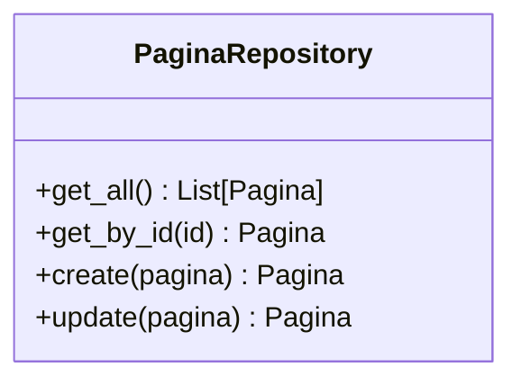
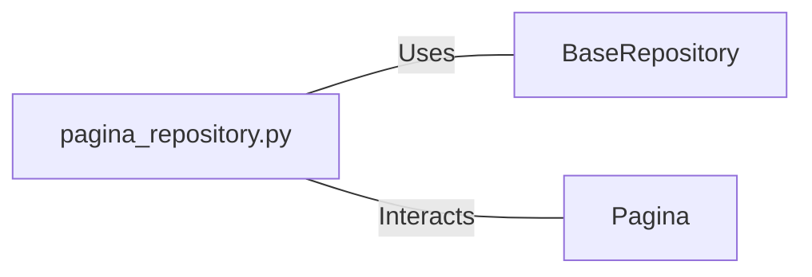

# pagina_repository.py: Pagina Repository Management

## Overview
This module defines the `PaginaRepository` class, which provides methods for interacting with the `Pagina` model. It extends the functionalities of the `BaseRepository` to perform CRUD operations specifically for `Pagina` objects.

## Process Flow

## Insights
- The `PaginaRepository` class is designed to interact with `Pagina` model instances, providing a layer of abstraction over the `BaseRepository` generic methods.
- It initializes with a `BaseRepository` instance specifically configured for `Pagina` model operations.
- Provides four main methods: `get_all`, `get_by_id`, `create`, and `update`, each tailored to handle `Pagina` objects.
- The `create` and `update` methods expect an object that can be converted to a `Pagina` model instance using its `dict()` method, ensuring flexibility in handling input data.

## Dependencies

- `BaseRepository` : The `PaginaRepository` class depends on `BaseRepository` for database operations, utilizing its generic CRUD methods.
- `Pagina` : This class is specifically designed to handle instances of the `Pagina` model, directly interacting with it for creating and updating operations.