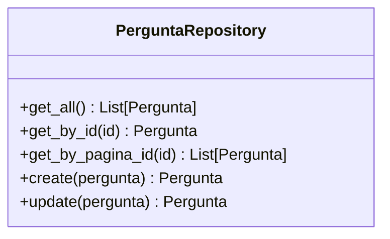
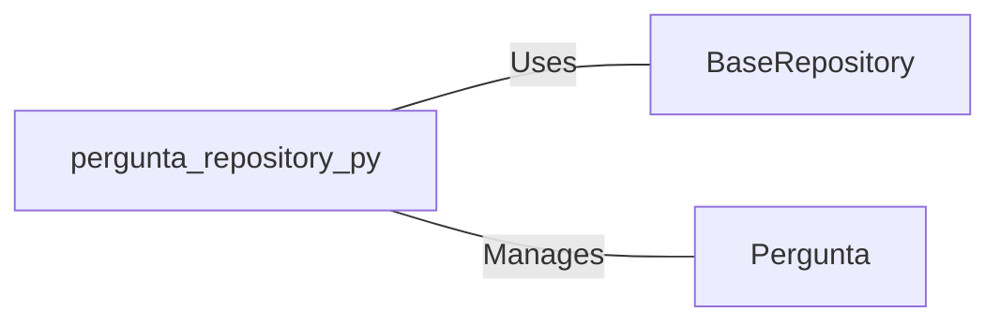

# pergunta_repository.py: Pergunta Repository Management

## Overview

This module defines the `PerguntaRepository` class, which is responsible for managing the CRUD operations related to `Pergunta` model objects. It acts as an intermediary between the `Pergunta` model and the `BaseRepository`, facilitating the interaction with the database.

## Process Flow

## Insights

- The `PerguntaRepository` class inherits from `BaseRepository`, leveraging generic database operations.
- It specifically manages objects of the `Pergunta` model.
- Provides methods to retrieve all `Pergunta` objects, get a single `Pergunta` by its ID, get `Pergunta` objects by `pagina_id`, and to create or update a `Pergunta` object.
- Utilizes the `**pergunta.dict()` pattern to convert a `Pergunta` object into a dictionary for creation and update operations, ensuring compatibility with the `BaseRepository` methods.

## Dependencies

- `BaseRepository` : The `PerguntaRepository` uses generic CRUD operations provided by `BaseRepository`.
- `Pergunta` : The repository manages instances of the `Pergunta` model, performing operations like creation, retrieval, and updates.