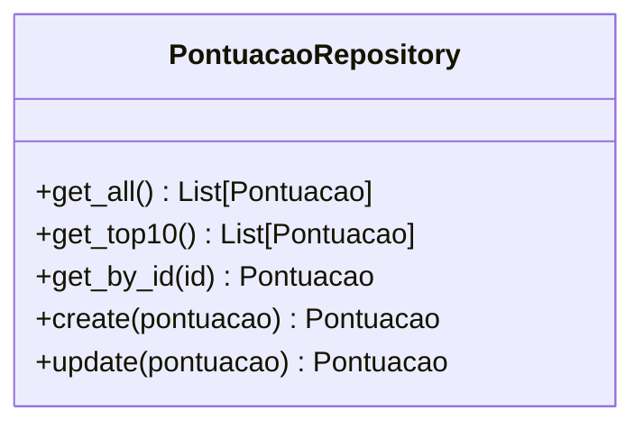
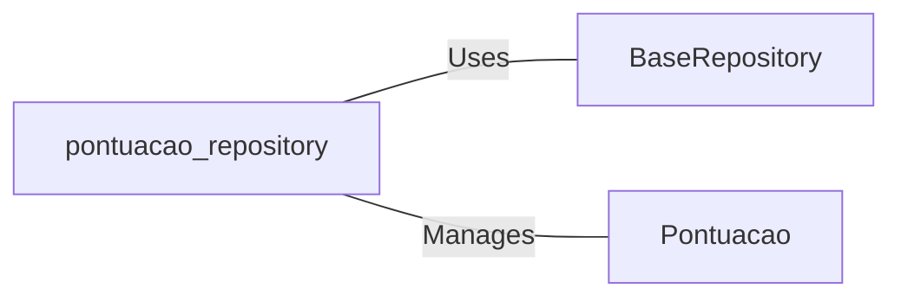

# pontuacao_repository.py: Pontuacao Repository Management

## Overview

This module defines the `PontuacaoRepository` class responsible for managing score (pontuacao) data interactions. It provides methods to retrieve all scores, the top 10 scores, retrieve a score by its ID, and to create or update scores in the repository.

## Process Flow

## Insights

- The `PontuacaoRepository` class extends functionality from a `BaseRepository`, leveraging generic CRUD operations.
- It specifically manages instances of `Pontuacao`, a model representing score data.
- The `get_top10` method sorts scores in descending order before returning the top 10, indicating a leaderboard functionality.
- Creation and update methods require a `pontuacao` object, which is expected to be an instance of a Pydantic model, given the use of `.dict()` method for serialization.

## Dependencies

- `BaseRepository` : The generic repository class providing CRUD operations. The nature of the relation is usage for database interactions.
- `Pontuacao` : The data model for score entities. It is managed by `PontuacaoRepository` indicating that this repository is specifically for handling score data.