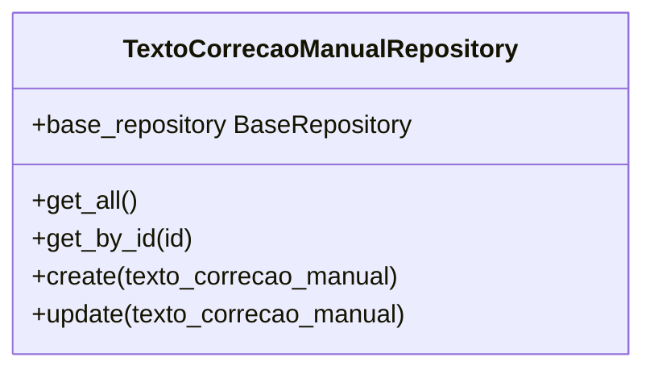
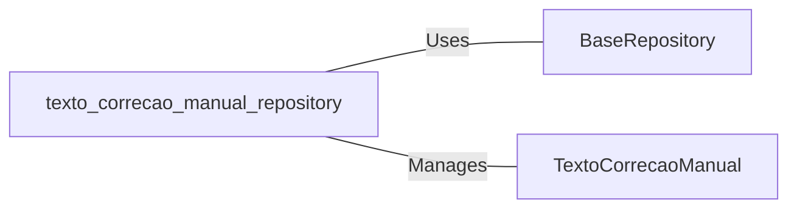

# texto_correcao_manual_repository: TextoCorrecaoManualRepository Management

## Overview
This document describes the `TextoCorrecaoManualRepository` class, which is responsible for managing the CRUD operations related to `TextoCorrecaoManual` objects. It acts as an intermediary between the higher-level application logic and the database, abstracting the complexities of direct database access.

## Process Flow

## Insights
- The `TextoCorrecaoManualRepository` class inherits from `BaseRepository`, leveraging generic CRUD operations.
- It specifically manages instances of `TextoCorrecaoManual`, a model representing manual text corrections.
- The repository provides methods to retrieve all instances (`get_all`), retrieve a specific instance by its ID (`get_by_id`), create a new instance (`create`), and update an existing instance (`update`).
- Object creation and updates are facilitated by unpacking dictionaries into `TextoCorrecaoManual` model instances, ensuring data integrity and simplifying object manipulation.

## Dependencies

- `BaseRepository` : The base class providing generic CRUD operations, used for abstracting database interactions.
- `TextoCorrecaoManual` : The data model representing manual text corrections, which is the primary entity managed by this repository.