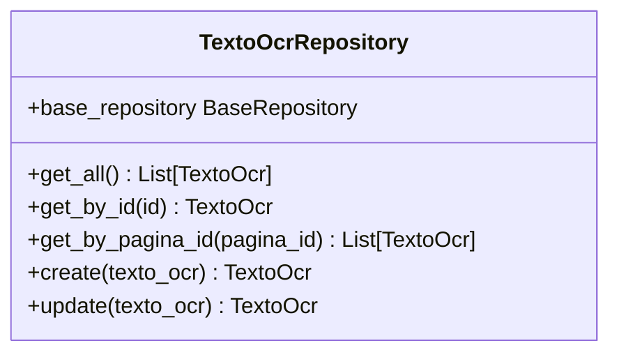
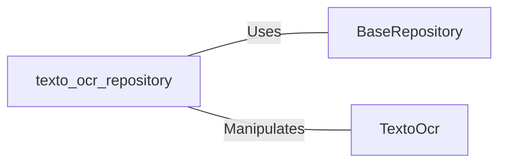

# texto_ocr_repository: TextoOcrRepository Management

## Overview
This document describes the `TextoOcrRepository` class, which is responsible for managing OCR text data. It provides methods to retrieve, create, and update OCR text records in a database.

## Process Flow

## Insights
- Inherits from `BaseRepository`, leveraging its generic database operations.
- Utilizes the `TextoOcr` model for data representation and manipulation.
- Provides specialized methods to query OCR text data by page ID (`pagina_id`).
- Supports creation and update of OCR text records through dictionary unpacking and model instantiation.

## Dependencies

- `BaseRepository` : The base class providing generic CRUD operations. The relation is of type 'Uses'.
- `TextoOcr` : The data model representing OCR text entities. The relation is of type 'Manipulates'.