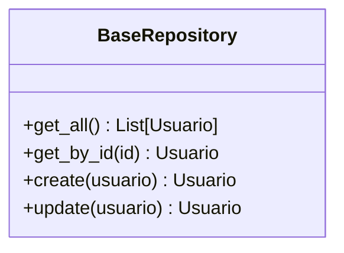
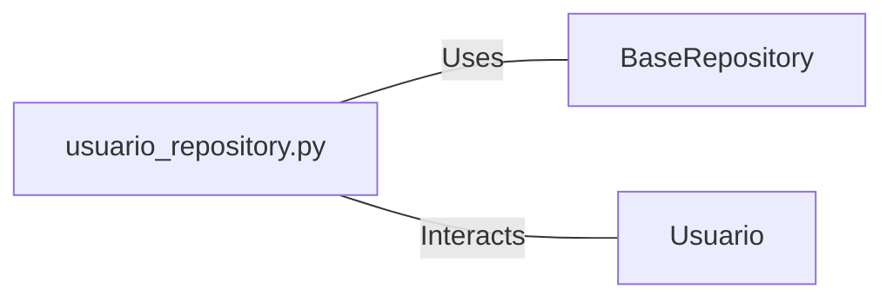

# usuario_repository.py: User Repository Management

## Overview

This module is responsible for managing user data interactions, providing an abstraction layer over basic CRUD operations. It leverages a base repository pattern to interact with user entities.

## Process Flow

## Insights

- The module defines a class that extends functionality from a base repository, specifically tailored for user (`Usuario`) entities.
- It provides methods to retrieve all users, find a user by ID, create a new user, and update an existing user.
- User creation and update methods expect an object that can be converted to a `Usuario` model instance using its `dict()` method, ensuring data consistency.
- This abstraction simplifies user data management by encapsulating the database operations, making the codebase cleaner and more maintainable.

## Dependencies

- `BaseRepository` : The base class that provides common repository operations. It is extended by the user repository to manage user entities.
- `Usuario` : The user model that defines the structure and behavior of user entities in the system. It is used for creating and updating users in the repository.