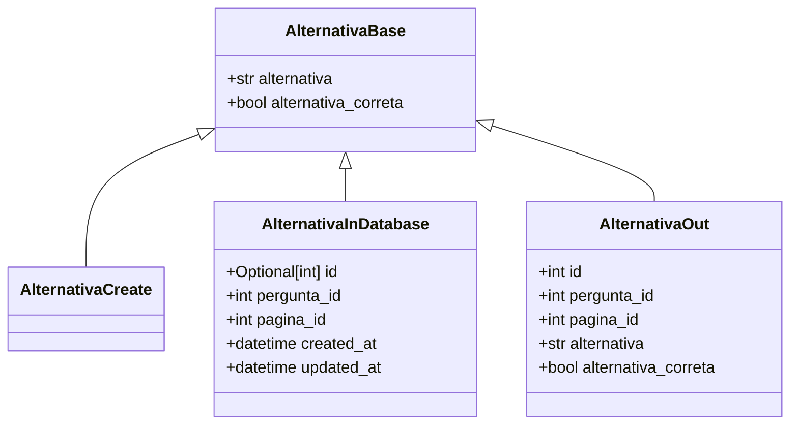
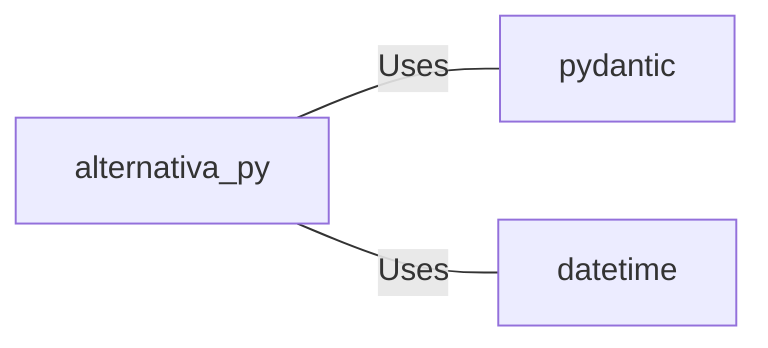

# alternativa.py: Alternativa Data Models

## Overview

This code defines data models related to "Alternativa" (Option) using Pydantic for data validation and serialization. It includes base models and specialized models for creating new alternatives, storing them in a database, and outputting alternative data.

## Process Flow

## Insights

- The `AlternativaBase` model serves as the base model with common fields `alternativa` (option text) and `alternativa_correta` (whether the option is correct).
- `AlternativaCreate` is a model for creating new alternatives, inheriting from `AlternativaBase` without adding new fields, indicating it uses the base model fields for creation.
- `AlternativaInDatabase` extends `AlternativaBase` with additional fields for database management, including `id`, `pergunta_id` (question ID), `pagina_id` (page ID), `created_at`, and `updated_at` timestamps.
- `AlternativaOut` is designed for outputting alternative data, including all fields from `AlternativaBase` plus `id`, `pergunta_id`, and `pagina_id`, indicating it's a comprehensive model for external representation.
- The use of `Optional[int] | None = None` for the `id` field in `AlternativaInDatabase` suggests that `id` is optional and can be `None`, typically used for new records not yet stored in the database.
- The `created_at` and `updated_at` fields in `AlternativaInDatabase` are automatically set to the current datetime, indicating automatic timestamping of record creation and updates.

## Dependencies

This code depends on external libraries for its functionality:

- `pydantic` : Used for data validation and serialization, providing the `BaseModel` for defining the data models.
- `datetime` : Used for managing datetime fields in the models, specifically for `created_at` and `updated_at` fields in `AlternativaInDatabase`.