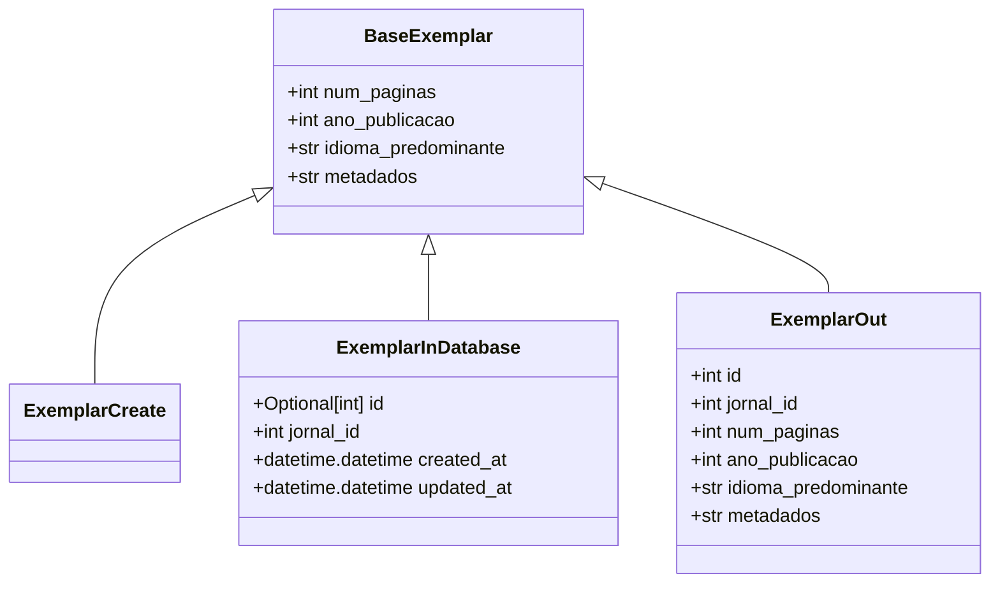
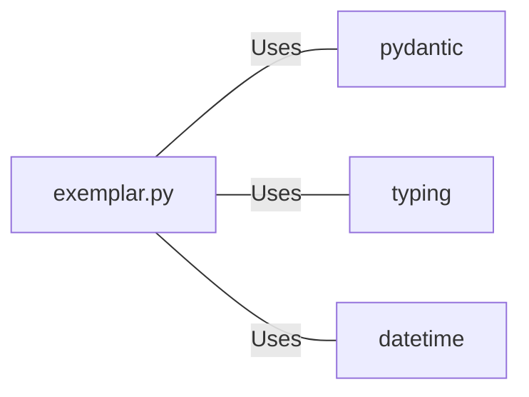

# exemplar.py: Exemplar Data Models

## Overview

This code defines data models related to "Exemplar" entities using Pydantic for data validation. These models are designed to handle different stages of data flow, from creation to database storage and output representation.

## Process Flow

## Insights

- The `BaseExemplar` class serves as the base model with common attributes for all exemplar entities, including `num_paginas`, `ano_publicacao`, `idioma_predominante`, and `metadados`.
- `ExemplarCreate` is a placeholder class for creating new exemplar entities, inheriting all attributes from `BaseExemplar` without adding new ones.
- `ExemplarInDatabase` extends `BaseExemplar` with additional attributes for database management, such as `id`, `jornal_id`, `created_at`, and `updated_at`. It uses Python's Optional typing to allow `id` to be `None`.
- `ExemplarOut` is designed for output representation of an exemplar entity, including all base attributes along with `id` and `jornal_id`.
- The use of `datetime.datetime.now()` for `created_at` and `updated_at` in `ExemplarInDatabase` ensures that these timestamps are automatically generated upon instantiation.
- The models leverage Python's type hinting and Pydantic for data validation and serialization, ensuring that data conforms to the defined schema.

## Dependencies

- `pydantic` : Used for data validation and serialization in the defined models.
- `typing` : Provides support for type hints, including the use of `Optional`.
- `datetime` : Utilized for managing `created_at` and `updated_at` timestamps in `ExemplarInDatabase`.