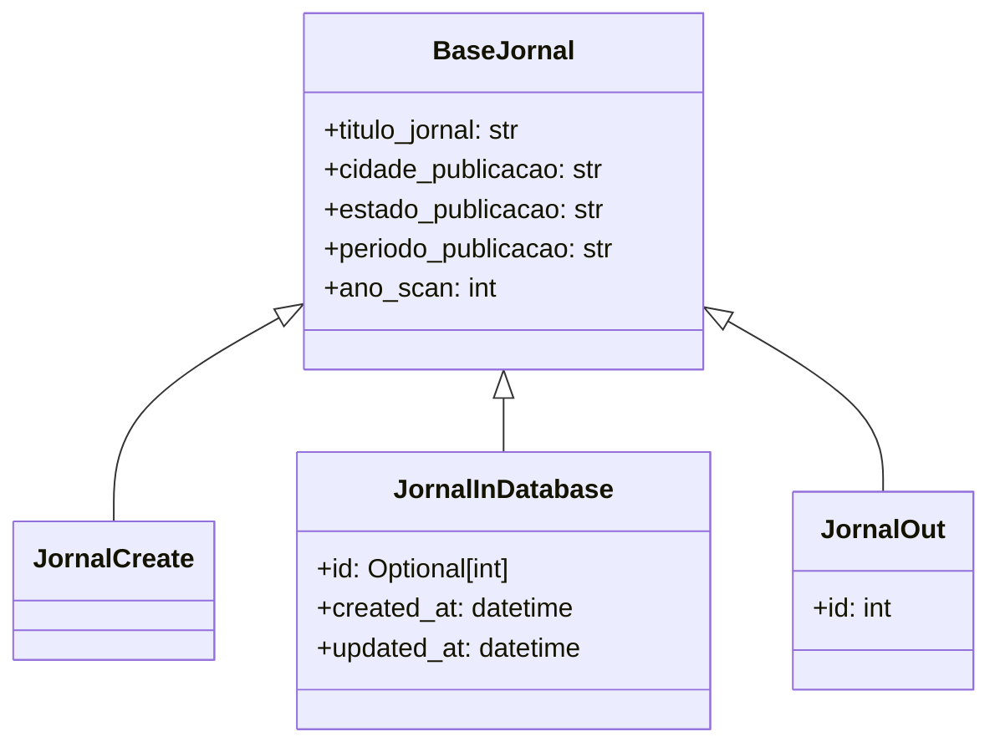
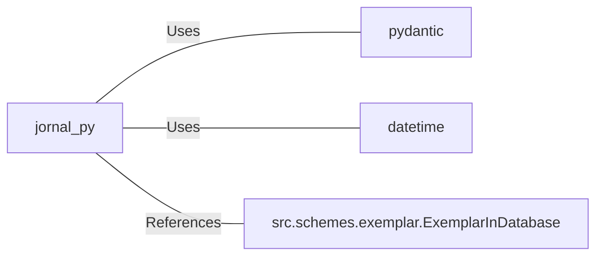

# jornal.py: Jornal Data Models

## Overview
This module defines data models related to jornal (newspaper) entities, including their creation, storage, and output representation. It utilizes Pydantic for data validation and typing.

## Process Flow

## Insights
- The `BaseJornal` class serves as the base model with common attributes for different jornal representations.
- `JornalCreate` is a model for creating a new jornal entry, inheriting from `BaseJornal` without additional attributes.
- `JornalInDatabase` extends `BaseJornal` with `id`, `created_at`, and `updated_at` fields for database entries, utilizing Python's `datetime` for timestamps.
- `JornalOut` is designed for output representation of a jornal, including an `id` field along with the base attributes.
- The use of `Optional[int]` for the `id` field in `JornalInDatabase` indicates that it can be `None`, typically before a new entry is saved to the database.
- The module relies on Pydantic for data validation and typing, ensuring that instances of these models meet the defined schema requirements.

## Dependencies

- `pydantic` : Used for data validation and typing.
- `datetime` : Utilized for managing creation and update timestamps.
- `src.schemes.exemplar.ExemplarInDatabase` : Referenced but not directly used within the models, indicating a relationship or dependency for future implementations or extensions.