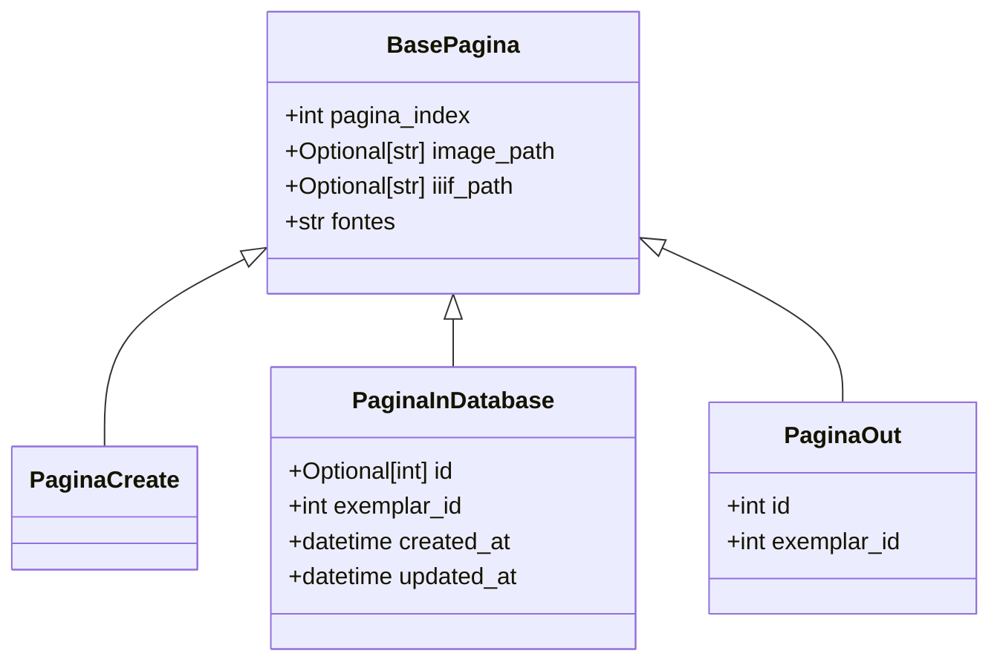
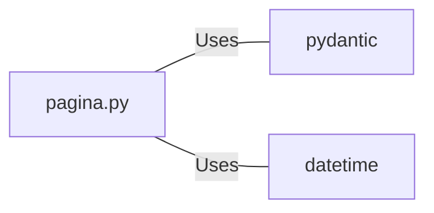

# pagina.py: Pagina Data Models

## Overview

This document describes the data models related to "Pagina" (Page) in a newspaper context, including their creation, storage, and output representation.

## Process Flow

## Insights

- The `BasePagina` class serves as the base model with common attributes for different representations of a newspaper page.
- `PaginaCreate` is a model for creating a new page entry, inheriting attributes from `BasePagina` without additional properties.
- `PaginaInDatabase` extends `BasePagina` with database-specific fields such as `id`, `exemplar_id`, and timestamps for creation and update.
- `PaginaOut` is tailored for output representation, including essential identifiers and inherited attributes from `BasePagina`.
- The models utilize Python's type hinting and the Pydantic library for data validation and settings management.
- Optional fields like `image_path` and `iiif_path` allow for flexibility in specifying the location of page images.
- The use of `datetime.datetime.now()` for `created_at` and `updated_at` in `PaginaInDatabase` ensures timestamps are automatically generated upon model instantiation.

## Dependencies

- `pydantic` : Used for data validation and settings management in the models.
- `datetime` : Utilized for managing timestamps in the `PaginaInDatabase` model.