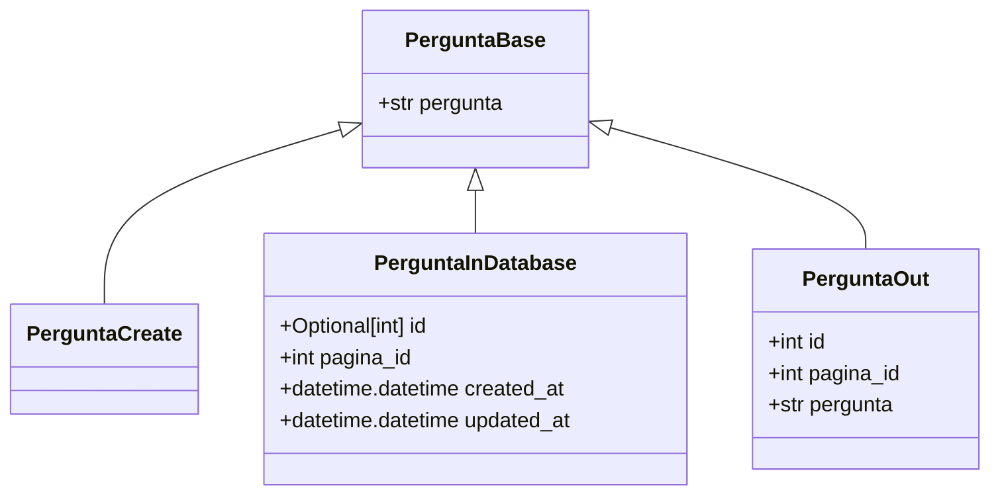
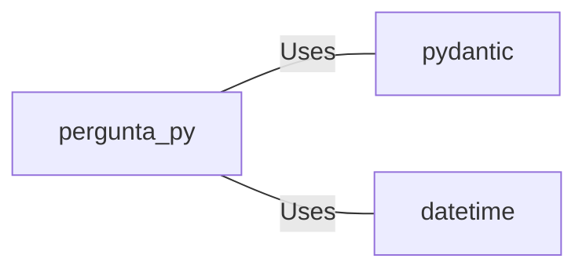

# pergunta.py: Pergunta Data Models

## Overview

This module defines data models related to "Pergunta" (Question) using Pydantic for data validation and serialization. It includes models for base question attributes, question creation, question representation in the database, and question output.

## Process Flow

## Insights

- The `PerguntaBase` model is the foundation, containing the essential attribute `pergunta` (question), which is a string.
- `PerguntaCreate` is a model intended for question creation. It inherits from `PerguntaBase` without adding any new attributes, indicating it uses the base attributes for creation.
- `PerguntaInDatabase` extends `PerguntaBase` with additional attributes for database management, including `id`, `pagina_id`, `created_at`, and `updated_at`. The `id` is optional and can be `None`, suggesting it's auto-generated by the database. `created_at` and `updated_at` are automatically set to the current datetime, indicating automatic timestamping on creation.
- `PerguntaOut` is designed for output representation of a question. It includes `id`, `pagina_id`, and `pergunta`, ensuring that essential identifiers and the question itself are part of the output.

## Dependencies

- `pydantic` : Used for data validation and serialization, indicating the use of Pydantic models for defining the structure and constraints of the data.
- `datetime` : Utilized for managing date and time information, specifically for `created_at` and `updated_at` fields in `PerguntaInDatabase`.