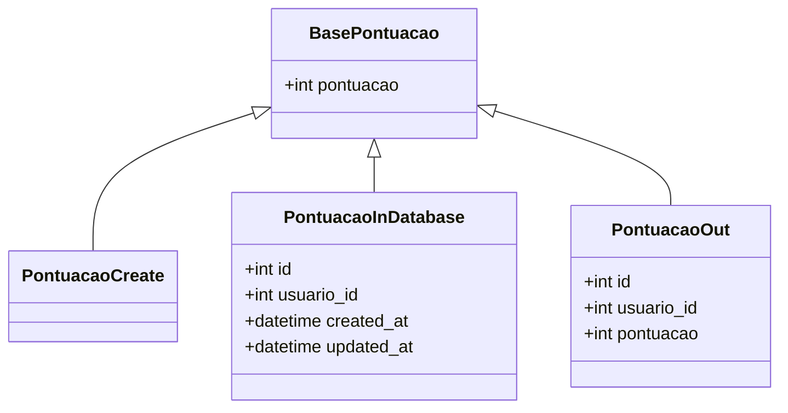
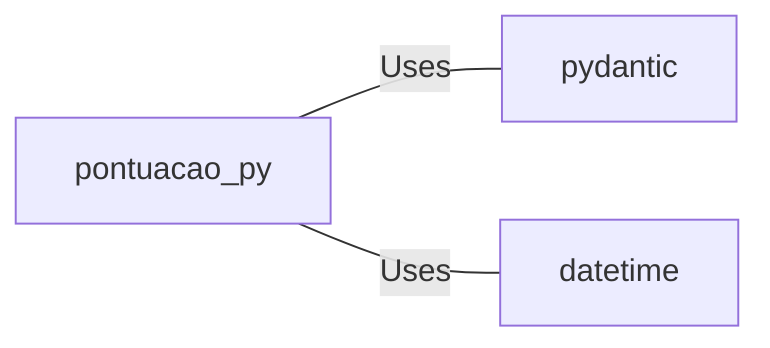

# pontuacao.py: Data Structure Definitions for Score Management

## Overview

This document outlines the structure of data models used for managing score records within an application. It defines base and derived models for creating, storing, and outputting score data, leveraging the Pydantic library for data validation.

## Process Flow

## Insights

- The `BasePontuacao` class serves as the foundational model with a single field `pontuacao` representing the score.
- `PontuacaoCreate` is a placeholder class that currently inherits all attributes from `BasePontuacao` without adding any new fields. It's designed for creating new score records.
- `PontuacaoInDatabase` extends `BasePontuacao` with additional fields for database management, including `id`, `usuario_id`, and timestamps for record creation and updates.
- `PontuacaoOut` is tailored for output purposes, including essential fields such as `id`, `usuario_id`, and `pontuacao`.
- The use of Pydantic's `BaseModel` ensures that all data models benefit from data validation and serialization features.
- Timestamps in `PontuacaoInDatabase` are automatically set to the current datetime upon instantiation, simplifying record creation.

## Dependencies

This code relies on external libraries for its functionality:

- `pydantic` : Provides the `BaseModel` for data validation and serialization.
- `datetime` : Used for managing datetime fields in `PontuacaoInDatabase`.