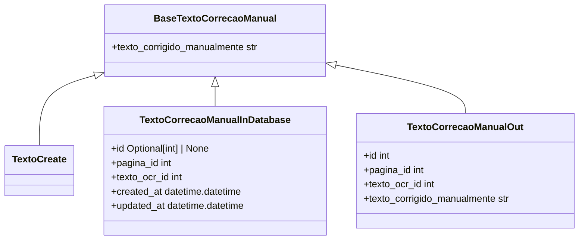

# texto_correcao_manual.py: Text Correction Manual Models

## Overview

This module defines data models related to manual text correction, including the base model for corrected text, models for creating new text corrections, and models for representing text corrections in the database and as output data.

## Process Flow

## Insights

- The `BaseTextoCorrecaoManual` model serves as the base model with a single field `texto_corrigido_manualmente`, which represents the manually corrected text extracted from OCR.
- `TextoCreate` is a model for creating new text corrections. It inherits from `BaseTextoCorrecaoManual` without adding any new fields, indicating it uses the base model directly for creation purposes.
- `TextoCorrecaoManualInDatabase` extends `BaseTextoCorrecaoManual` with additional fields for database management, including `id`, `pagina_id`, `texto_ocr_id`, and timestamps for `created_at` and `updated_at`. The `id` field is optional, allowing for flexibility in instances where an ID may not be immediately available.
- `TextoCorrecaoManualOut` is designed for output purposes, extending `BaseTextoCorrecaoManual` with fields `id`, `pagina_id`, and `texto_ocr_id` to provide a comprehensive view of the text correction data.
- The use of `datetime.datetime.now()` for both `created_at` and `updated_at` fields in `TextoCorrecaoManualInDatabase` implies that these timestamps are set to the current date and time when a new instance is created.