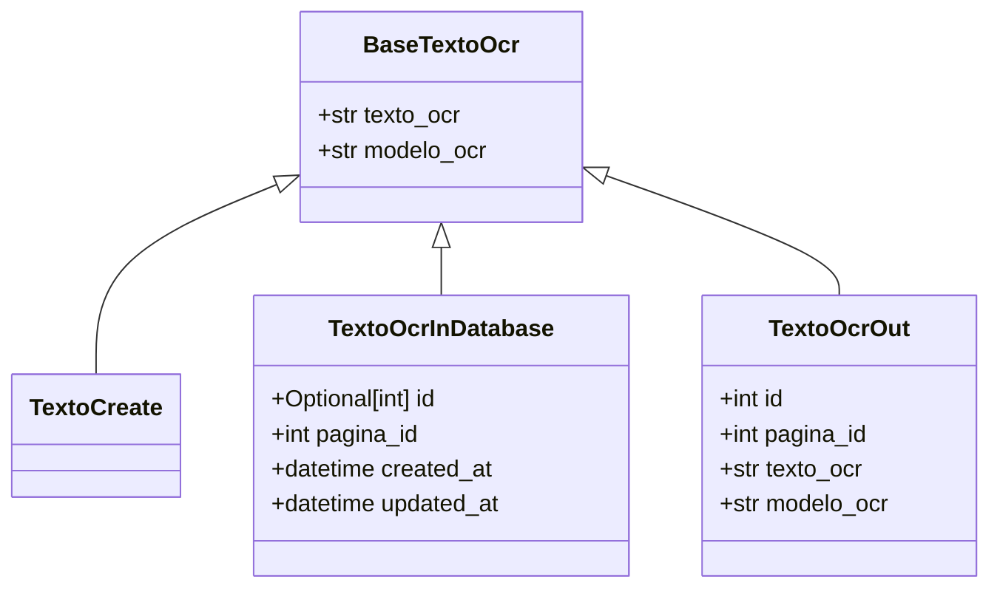

# texto_ocr.py: Text OCR Models

## Overview

This code defines data models related to OCR (Optical Character Recognition) text processing, using Pydantic for data validation.

## Process Flow

## Insights

- The `BaseTextoOcr` class serves as a base model for OCR text, including the extracted text (`texto_ocr`) and the OCR model used (`modelo_ocr`).
- `TextoCreate` is a placeholder class that currently inherits from `BaseTextoOcr` without adding any new fields, indicating it's used for creating new OCR text entries.
- `TextoOcrInDatabase` extends `BaseTextoOcr` with additional fields for database management, including an optional ID, page ID (`pagina_id`), and timestamps for creation and update.
- `TextoOcrOut` is designed for output purposes, extending `BaseTextoOcr` with mandatory ID and page ID fields, ensuring these are included in any output data.
- The use of `Optional[int] | None = None` for the `id` field in `TextoOcrInDatabase` indicates that this field is optional and defaults to `None`, accommodating new entries not yet assigned an ID.
- The `created_at` and `updated_at` fields in `TextoOcrInDatabase` are automatically set to the current datetime, simplifying the tracking of when entries are created and modified.
- Pydantic's `BaseModel` is utilized for data validation, ensuring that instances of these models conform to the expected structure and types.