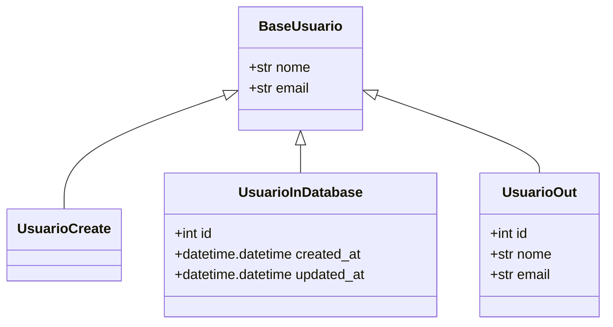
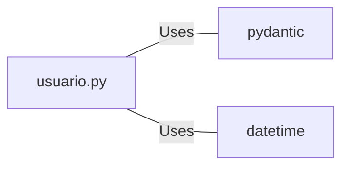

# usuario.py: User Data Models

## Overview
This module defines data models related to user entities using Pydantic for validation. It includes models for creating a user, representing a user in the database, and outputting user information.

## Process Flow

## Insights
- The `BaseUsuario` class serves as the base model with common attributes `nome` and `email` for all user-related models.
- `UsuarioCreate` is a model intended for creating new users, inheriting from `BaseUsuario` without adding additional fields.
- `UsuarioInDatabase` extends `BaseUsuario` with `id`, `created_at`, and `updated_at` fields to represent a user entity in the database. The `created_at` and `updated_at` fields are automatically set to the current datetime.
- `UsuarioOut` is designed for outputting user information, including the user's `id`, `nome`, and `email`.

## Dependencies

- `pydantic` : Used for data validation and settings management through BaseModel.
- `datetime` : Utilized for managing date and time information, specifically in the `UsuarioInDatabase` model.