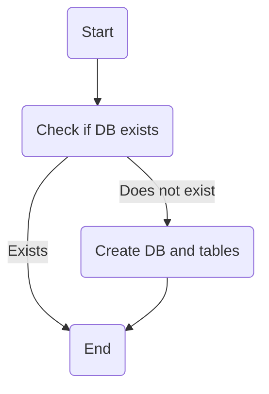

# create_tables.py: Database Initialization

## Overview
This script is responsible for initializing a database by creating necessary tables.

## Process Flow

## Insights
- The script checks if the database and tables already exist before attempting to create them.
- It uses a try-except block to handle any exceptions that might occur during the database and tables creation process.
- The actual creation of the database and tables is abstracted away in the `create_db_and_tables` function, which is imported from another module.
- The script is designed to be executed as a standalone program.

## Dependencies

- `database.database` : This module is expected to provide the `get_engine` and `create_db_and_tables` functions, which are essential for connecting to the database and initializing it by creating necessary tables. The nature of the relation is that `create_tables.py` utilizes these functions to perform its main job.