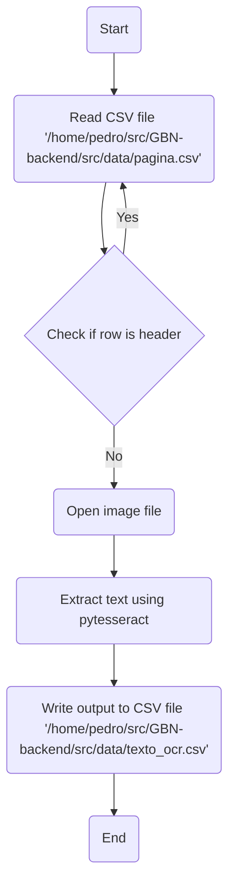
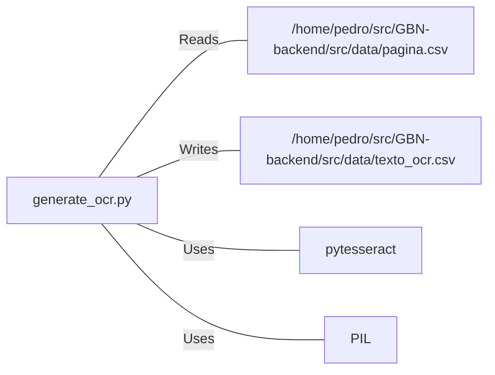

# generate_ocr.py: OCR Text Extraction

## Overview
This script is designed to read image file paths from a CSV file, extract text from these images using Optical Character Recognition (OCR) via the `pytesseract` library, and then write the extracted text along with some metadata back to a different CSV file.

## Process Flow

## Insights
- The script skips the first row of the CSV file assuming it to be a header row.
- It uses the `PIL` library to open image files.
- Text extraction is performed using the `pytesseract` library.
- The output CSV file is appended with the extracted text and metadata for each image processed. The metadata includes the page ID and the OCR model used (`tesseract`).
- The delimiter used in the output CSV file is `;`.
- The script assumes the input CSV file has the image file path in the third column of each row.

## Dependencies

- `pagina_csv` : The input CSV file containing image paths. The script reads this file.
- `texto_ocr_csv` : The output CSV file where extracted text and metadata are written.
- `pytesseract` : Python library used for OCR. The script uses this to extract text from images.
- `PIL` : Python Imaging Library used to open image files.