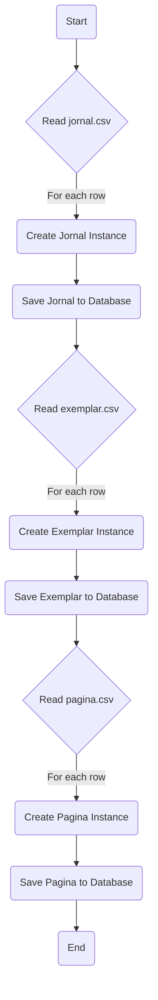
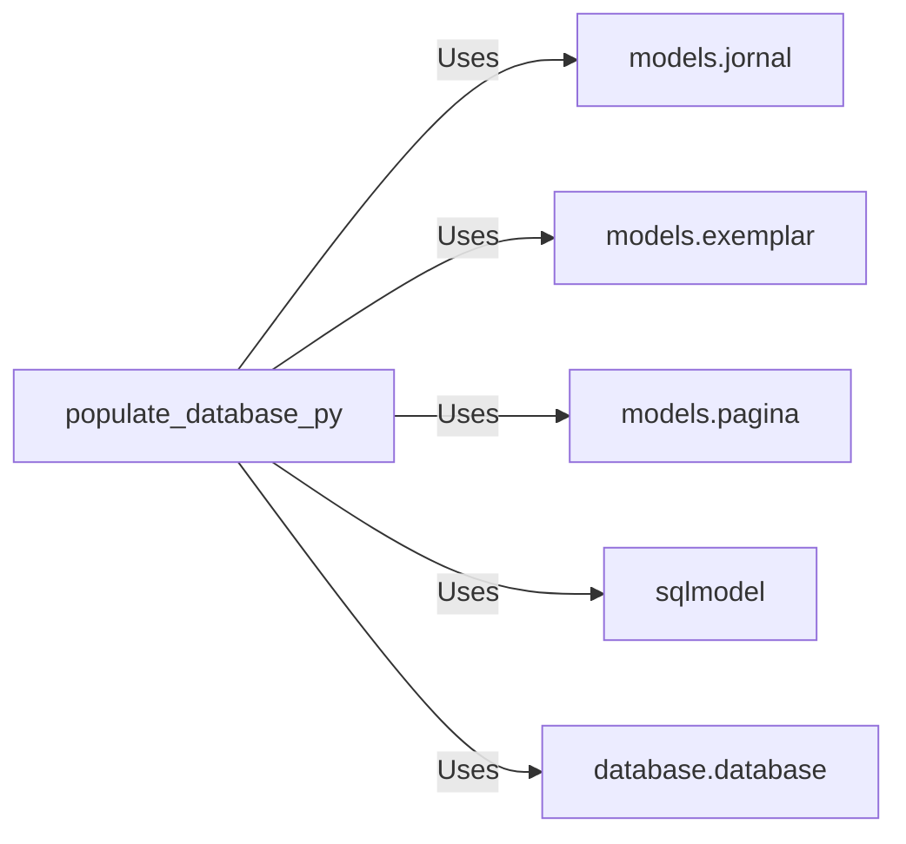

# populate_database.py: Populate Database with CSV Data

## Overview
This script is responsible for populating a database with data from CSV files. It specifically targets three types of data: Jornal, Exemplar, and Pagina, each corresponding to a different CSV file. The script reads each CSV file, creates instances of the respective models, and saves them to the database.

## Process Flow

## Insights
- The script uses the `sqlmodel` library to interact with the database, specifically utilizing the `Session` class for database sessions.
- CSV files for Jornal, Exemplar, and Pagina are expected to be located in a specific path (`/home/pedro/src/GBN-backend/src/data/`).
- The first row of each CSV file, assumed to be the header, is skipped during the data import process.
- Each data import function (`populate_jornal`, `populate_exemplar`, `populate_pagina`) commits changes to the database after adding each individual record, which may not be efficient for large datasets.
- The script directly executes the data population functions for Jornal, Exemplar, and Pagina in sequence, indicating a linear and straightforward execution flow.

## Dependencies

- `models.jornal` : The Jornal model used to create instances from CSV data.
- `models.exemplar` : The Exemplar model used to create instances from CSV data.
- `models.pagina` : The Pagina model used to create instances from CSV data.
- `sqlmodel` : Library used for database interaction, specifically for creating sessions.
- `database.database` : Contains the `get_engine` function used to obtain the database engine for sessions.