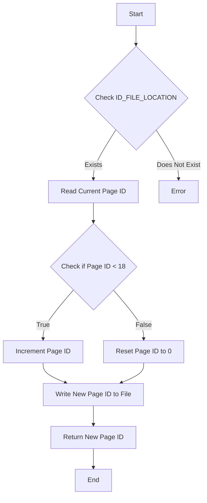
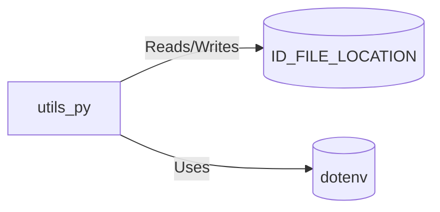

# utils.py: File Handling and Environment Variable Management

## Overview

This module is responsible for managing environment variables and handling file operations related to retrieving and updating a page identifier.

## Process Flow

## Insights

- The module relies on an environment variable `ID_FILE_LOCATION` to determine the file path for reading and writing the page identifier.
- It reads the current page identifier from the specified file, increments it if it is less than 18, or resets it to 0 otherwise.
- The updated page identifier is then written back to the same file.
- This operation is encapsulated in the `get_prox_pagina` function, which returns the new page identifier.
- The module uses the `dotenv` package to load environment variables from a `.env` file, enhancing security and configurability.

## Dependencies

- `ID_FILE_LOCATION` : The file path for the page identifier, read and written by `get_prox_pagina`. The nature of the relation is both reading and writing the page identifier.
- `dotenv` : A package used to load environment variables from a `.env` file, enhancing the configurability and security of the application. The nature of the relation is using the package to access environment variables.